# 5 系统详细设计与实现

在第四章系统概要设计的基础上，本章对系统五大核心功能模块的详细设计、技术实现和核心代码逻辑进行全面阐述。首先详细介绍贯穿各模块的系统安全基础设施（JWT 认证、RBAC 权限控制、AOP 操作日志审计），然后依次阐述数据导入导出模块、日常诊疗模块、智能查询与辅助诊断模块、预警监控模块、统计分析报表模块和系统运维管理模块的具体实现，最后给出本章小结。

## 5.1 系统安全模块设计与实现

系统安全模块是所有业务模块的横切基础设施，承担身份认证、权限校验和操作审计三项核心职责，确保系统在医疗数据管理场景下的安全性、合规性和可追溯性。

### 5.1.1 JWT 身份认证机制

系统采用 JWT（JSON Web Token）作为前后端分离架构下的无状态身份认证方案。用户登录时，后端接收登录账号和密码，验证通过后使用 HMAC-SHA256 算法生成包含用户 ID（userId）和登录账号（loginAccount）的 JWT Token，有效期设置为 2 小时。Token 由头部（Header）、载荷（Payload）和签名（Signature）三部分组成，以点号分隔后进行 Base64 编码，返回给前端。前端将 Token 存储在浏览器的 localStorage 中，后续每次请求通过 Axios 拦截器自动在请求头中携带 `Authorization: Bearer <token>`。

后端通过 `JwtInterceptor` 拦截器对所有非公开接口进行 Token 校验，拦截器在 `WebConfig` 中注册，排除登录、注册、Swagger 文档和文件下载等公开路径。校验流程如下：从请求头 `Authorization` 字段提取 Token → 去除 `Bearer ` 前缀 → 调用 `JwtUtil.validateToken()` 方法验证 Token 签名和有效期 → 校验通过后将 `userId` 和 `loginAccount` 注入 `HttpServletRequest` 属性中。校验失败的请求返回 HTTP 401 状态码，提示"未登录或 Token 已过期"，从而确保所有业务接口在有效认证的保护下运行。

JWT 认证的完整交互流程如图 5-1 所示。

（此处插入图 5-1 JWT 认证时序图。图类型：PlantUML 时序图。尺寸建议：宽度约 14cm，占页面约 1/2。图中 3 个参与方（前端、JwtInterceptor、JwtUtil），分为"登录签发"和"后续请求校验"两个阶段，含 alt 分支（Token 有效/无效），建议横向排版。）

### 5.1.2 基于 RBAC 的分级权限控制

系统基于 RBAC（Role-Based Access Control，基于角色的访问控制）模型实现了精细化的权限管理。权限体系由五张数据表构成：用户表（user）、角色表（sys_role）、权限表（sys_permission）、用户角色关联表（sys_user_role）和角色权限关联表（sys_role_permission），形成"用户→角色→权限"三级关联结构。

系统预设了四种角色：系统管理员（admin）拥有全部权限；医生（user）可查看和录入检查与检验数据、导出报表，但不可删除他人数据；检验技师（technician）管理检验结果、维护检验项目字典与预警规则；审计员（auditor）仅拥有只读权限，专门审查操作日志和审计记录。在角色权限基础上，系统进一步定义了 16 项细粒度操作权限编码，涵盖患者管理（patient:view / patient:manage）、CT 检查管理（ct:view / ct:manage）、核磁检查管理（mri:view）、肠镜检查管理（enteroscopy:view）、病理检查管理（pathology:view）、检验结果管理（lab:view / lab:manage）、统计查看（statistics:view）、预警管理（warning:manage / warning:view）、审计日志查看（audit:view）、数据导入（data:import）、数据导出（data:export）和备份管理（backup:manage）等全部业务操作。

权限校验在 `JwtInterceptor` 中完成，采用两层兜底机制。Token 校验通过后，拦截器查询当前用户的角色：若角色为 admin，直接放行所有请求；对于其他角色，优先通过 `PermissionService.hasPermission(userId, permissionCode)` 方法查询 RBAC 五表关联关系进行精确权限匹配；若权限表尚未初始化数据，则通过 `ROLE_PERMISSIONS` 映射中配置的路径白名单进行粗粒度降级校验。对于无权限的请求，拦截器直接返回 HTTP 403 状态码。前端通过 v-if 指令根据用户角色隐藏无权限的菜单项和操作按钮，实现前后端双重权限控制。RBAC 权限校验的完整判断逻辑如图 5-2 所示。

（此处插入图 5-2 RBAC 权限校验流程图。图类型：PlantUML 活动图/流程图。尺寸建议：宽度约 12cm，占页面约 1/3。图中从"请求到达"开始，经过 admin 判断→RBAC 五表查权限编码→路径白名单兜底→放行或 403 拒绝，共 6 个判断分支，居中排版。）

### 5.1.3 基于 AOP 的操作日志审计

系统基于 Spring AOP 切面技术实现了对业务代码无侵入的全流程操作留痕，满足《医疗机构病历管理规定》"全程留痕、100% 可追溯"的合规要求。

操作日志审计的入口是自定义的 `@OperateLog` 注解，该注解包含三个属性：`operationType`（操作类型，如"新增""修改""作废""扫描"）、`operatedTable`（操作的表名，如"lab_result""patient"）和 `description`（操作描述，如"新增 CT 检查""修正检验结果录入错误"）。该注解标注在需要留痕的 Controller 方法上，开发人员无需在业务代码中编写日志逻辑。

`OperateLogAspect` 切面类通过 `@Around` 环绕通知拦截所有标注了 `@OperateLog` 注解的方法。切面方法的执行流程为：在目标方法执行前，通过 `RequestContextHolder.getRequestAttributes()` 获取当前 HTTP 请求的 IP 地址和请求参数；在目标方法执行后，读取注解的元数据（操作类型、操作表名、操作描述），将方法的入参序列化为修改前数据快照（`beforeContent`），将方法的返回结果序列化为修改后数据快照（`afterContent`），构建完整的 `OperationLog` 实体对象。日志写入通过 `@Async` 异步执行，避免日志记录 I/O 阻塞业务接口的响应性能。

操作日志表（operation_log）存储操作人 ID、操作时间、操作类型、操作表名、关联记录 ID、修改前后数据 JSON 快照等完整信息。该表在系统设计上仅暴露分页查询接口，不提供修改和删除接口，从接口层面保障日志记录的不可篡改和不可删除。管理员和审计员可按操作人、操作类型、操作时间范围等条件筛选查询操作日志，实现全流程操作追溯。AOP 切面从拦截方法到异步写入日志的完整执行过程如图 5-3 所示。

（此处插入图 5-3 AOP 操作日志拦截流程图。图类型：PlantUML 活动图/流程图。尺寸建议：宽度约 10cm，占页面约 1/4。图中展示 @Around 拦截→获取 IP→序列化入参→执行业务→序列化返回→fork 主线程返回/异步写日志，最后 stop。）

## 5.2 日常诊疗模块设计与实现

日常诊疗模块是系统的核心业务入口，负责患者诊疗全流程的基础数据管理。采用分层设计模式，分为 Controller 控制层、Service 业务层、Mapper 数据访问层，实现业务逻辑的解耦与复用。以患者档案登记为例，一次完整的请求从 Controller 参数校验到 Mapper 数据库写入的调用链路如图 5-7 所示。各子模块的详细实现如下。

（此处插入图 5-7 系统分层架构调用时序图。图类型：PlantUML 时序图。尺寸建议：宽度约 14cm，占页面约 1/2。图中 5 个参与方（前端→Controller→Service→Mapper→数据库 + AOP 切面），展示患者档案登记从参数校验到 AES 加密写入再到 AOP 异步日志的完整调用链，含 alt 分支（校验成功/失败），建议横向排版。）

### 5.2.1 患者信息管理

**（1）患者档案登记**

前端提交患者基础信息（姓名、性别、年龄、联系方式、身份证号等），后端 Controller 层接收请求后，进行参数合法性校验，包括身份证号格式校验和必填字段非空校验。校验通过后，Service 层生成唯一的患者编号（patient_id），对身份证号、手机号等敏感字段使用 AES 算法加密后，调用 Mapper 层写入患者信息表（patient），同时通过 `@OperateLog` 注解触发操作日志记录，完成档案创建。

**（2）患者信息修改**

支持患者信息的在线修改。修改前先校验用户权限，Service 层查询修改前的数据快照，执行更新操作后，AOP 切面自动对比并记录修改前后的数据差异，写入操作日志表，确保修改行为全程可追溯。

**（3）患者检索**

支持姓名模糊匹配与患者编号精准查询两种方式。基于 MyBatis-Plus 的 `QueryWrapper` 实现动态 SQL 拼接：若查询参数为纯数字，则按 patient_id 精确匹配；否则按 patient_name 进行模糊匹配（`LIKE '%keyword%'`）。patient_name 字段建有普通索引（idx_patient_name），确保模糊检索效率。

**（4）就诊全景汇总**

选中患者后，通过患者编号（patient_id）关联查询所有检查记录表（ct_examination、mri_examination、pathology_examination、enteroscopy_examination）、检验结果表（lab_result）和医嘱信息表（medical_order），按时间倒序排列，聚合生成患者的完整诊疗历史，返回给前端进行展示，让医生一站式了解患者的历次就诊情况。该全景查询跨越 6 张数据表的调用过程如图 5-8 所示。

（此处插入图 5-8 就诊全景查询时序图。图类型：PlantUML 时序图。尺寸建议：宽度约 14cm，占页面约 1/2。图中 8 个参与方（医生→Controller→Service→6 张数据表），核心亮点是 par 并行查询 6 张表后聚合合并，建议横向排版。）

### 5.2.2 检查记录管理

检查记录管理模块实现四类医技检查（CT、核磁、病理、肠镜）记录的录入、附件上传、预览下载、修改作废和查询全流程功能。四类检查各对应一张独立的数据表，各有专有字段（如病理检查有标本类型和切片图片链接，肠镜检查有肠镜类型和镜下诊断），但在代码层面共享相同的分层架构和操作流程。核心实现逻辑如下：

**（1）检查记录录入**

前端按检查类型录入对应的核心字段（如 CT 检查录入检查部位、检查医生、所属科室、报告结论；病理检查录入病理号、标本类型、病理诊断医生、病理诊断结论等），后端校验患者编号是否存在、必填字段是否完整，校验通过后写入对应的检查记录表，生成唯一的检查编号（examination_no 或 pathology_no），同时通过 `@OperateLog` 注解记录操作日志。

**（2）报告附件管理**

基于 Spring Boot 的文件上传功能实现，支持 PDF 报告、DICOM 影像、图片等格式的附件上传。文件上传后生成唯一的存储路径（如 `/ctExamination/download/{timestamp}_{filename}`），将附件元信息（附件名称、类型、存储路径、上传人、上传时间）写入附件信息表（attachment），与患者编号和检查记录关联。前端通过文件流接口实现附件的在线预览与下载，大文件支持分片下载。

**（3）记录修改与作废**

修改操作与患者信息修改逻辑一致，修改前后数据差异由 AOP 切面自动记录，全程留痕。作废操作采用逻辑删除机制，仅修改记录的 `is_invalid` 标识为 1，不进行物理删除，作废后仍可在后台通过 `is_invalid = 1` 条件追溯查询。误操作时可通过恢复功能将标识改回 0，避免数据误删丢失。

### 5.2.3 检验结果管理

检验结果管理模块实现检验结果的录入、批量登记和报告上传功能，核心实现逻辑如下：

**（1）单项目录入与批量登记**

单项目录入时，系统自动根据检验项目编码（item_code）查询检验项目字典表（lab_item_dict）中的正常参考范围（normal_range），比对录入的结果值（result_value），自动标记超出参考范围的结果。批量登记功能支持一次性勾选多个检验项目，前端提交批量结果数组，后端采用 Spring `@Transactional` 事务控制，确保批量录入的原子性——全部成功则提交，任意一条失败则回滚，避免数据不一致。对于同一患者同一批次的多项检验结果，系统生成统一的报告时间（report_time），便于后续按批次检索。批量登记的事务边界与数据流转过程如图 5-9 所示。

（此处插入图 5-9 检验结果批量登记事务时序图。图类型：PlantUML 时序图。尺寸建议：宽度约 14cm，占页面约 1/2。图中 6 个参与方（技师→Controller→@Transactional Service→2 个 Mapper→2 张数据表），核心是 loop 循环 + alt COMMIT/ROLLBACK 分支，展示事务原子性，建议横向排版。）

**（2）检验报告上传**

与检查报告附件管理逻辑一致，支持 PDF 格式的检验报告上传，上传后将报告 URL 写入检验结果表（lab_result）的 `report_url` 字段，与检验记录关联归档，支持在线预览与下载。

### 5.2.4 临床医嘱管理

临床医嘱管理模块实现医嘱的开具、修改和查询功能。医生在线填写医嘱项名称、住院次、医嘱状态、医嘱频率，指定执行科室和执行医生，系统自动获取当前登录用户为开嘱医生，记录开嘱时间，写入医嘱信息表（medical_order）。已开具的医嘱支持修改，修改前后数据差异由 AOP 切面自动记录，全程留痕。所有医嘱按患者编号、开始时间倒序分页展示，支持按患者编号、医嘱开始时间、执行科室进行筛选查询，方便交接班查阅与医嘱管理。

## 5.3 数据导入导出模块设计与实现

数据导入导出模块是系统解决医院历史数据迁移问题的核心模块，基于 EasyExcel 框架实现了五类检查数据（CT、核磁、病理、肠镜、检验结果）的 Excel 批量导入、XML 格式数据导入和查询结果的 Excel 导出功能。

### 5.3.1 EasyExcel 批量导入机制

EasyExcel 是由阿里巴巴开源的高性能 Java Excel 操作库，采用逐行读取和写入的策略，避免将整个 Excel 文件一次性加载到内存中，使得处理数万条甚至数十万条数据量的 Excel 文件成为可能。系统利用 EasyExcel 3.3.4 版本实现批量数据导入，核心设计如下：

**（1）导入架构设计**

四类检查数据的导入采用统一的架构模式：每种检查类型对应一个模板类（如 `CtImportTemplate`、`MriImportTemplate`、`PathologyImportTemplate`、`EnteroscopyImportTemplate`）、一个导入监听器类（如 `CtExcelImportListener`、`MriExcelImportListener`）和一个实体类（如 `CtExamination`、`MriExamination`）。模板类通过 `@ExcelProperty` 注解定义 Excel 列与 Java 字段的映射关系，监听器类继承 `AnalysisEventListener` 并实现逐行回调逻辑，在数据读取过程中即时完成字段映射、数据校验、重复检测和数据库写入。四类检查导入的类对应关系如表 5-1 所示。

表 5-1 四类检查数据导入类对应关系

| 检查类型 | 模板类 | 监听器类 | 实体类 | 导入编号字段 |
|:----:|------|------|------|------|
| CT 检查 | CtImportTemplate | CtExcelImportListener | CtExamination | examination_no |
| 核磁检查 | MriImportTemplate | MriExcelImportListener | MriExamination | examination_no |
| 病理检查 | PathologyImportTemplate | PathologyExcelImportListener | PathologyExamination | pathology_no |
| 肠镜检查 | EnteroscopyImportTemplate | EnteroscopyExcelImportListener | EnteroscopyExamination | examination_no |

**（2）三级数据校验机制**

系统在导入过程中自动执行三道数据校验，确保入库数据的准确性：

第一道格式校验：检查日期格式是否规范（如"yyyy-MM-dd HH:mm:ss"）、必填字段（如患者编号 patient_id）是否缺失。格式不合规的数据行标记为失败，记录失败原因。

第二道范围校验：检查数值类字段是否在合理范围内。对于超出正常临床范围的值（如检验结果值 > 10000），系统不会直接拒绝导入，而是标记警告提示用户确认，避免因配置错误导致正常数据被误拒。

第三道重复检测：按"检查编号 + 患者编号 + 检查时间"三个字段联合判定记录是否已存在。该判定逻辑利用各检查表上的 `idx_import_dup` 联合索引实现高效查询，已存在的重复记录自动跳过，不重复导入。

**（3）双模式导入策略**

系统提供两种导入模式供用户选择。严格模式下，遇到任何数据问题（格式错误、必填项缺失）即停止全部导入，已导入的数据自动回滚，确保入库数据零差错，适用于首次正式数据迁移场景。跳过模式下，自动跳过有问题的数据行，其余正常行继续导入，适用于大量数据中有少量瑕疵需快速完成主体导入的场景。

**（4）导入报告生成**

导入完成后，系统生成一份完整的导入报告，清晰展示：总共读取的行数、成功导入的行数、跳过的行数（含跳过原因）、失败的行数（含失败原因）。失败的数据行可一键下载为 CSV 文件，文件中标注 Excel 行号和失败原因，方便数据管理员对照原始数据修正后重新导入。EasyExcel 批量导入从文件上传到三级校验再到报告生成的完整执行流程如图 5-4 所示。

（此处插入图 5-4 EasyExcel 批量导入流程图。图类型：PlantUML 活动图/流程图。尺寸建议：宽度约 12cm，占页面约 1/2。图中包含 repeat 循环逐行读取→格式校验→范围校验→重复检测→严格/跳过模式分支→生成导入报告，最后 stop。）

### 5.3.2 XML 格式数据导入

除了 Excel 格式，系统还支持 XML 格式的检查数据批量导入。XML 数据通常来自其他医疗信息系统（如 HIS 医院信息系统、LIS 实验室信息系统）的数据导出，系统通过 `DocumentBuilderFactory` 解析 XML 文档，自动提取患者信息字段和检查结果字段，按照与 Excel 导入相同的校验和去重逻辑完成数据迁移。同样支持五类检查数据的分别导入，重复记录自动跳过，并支持下载标准 XML 导入模板供第三方系统参照。

### 5.3.3 数据导出实现

系统基于 EasyExcel 实现了检查记录和检验结果的 Excel 导出功能。用户选择需要导出的数据范围（查询结果或统计结果），后端根据导出条件查询对应的数据，通过 `EasyExcel.write()` 方法将数据流式写入 Excel 文件，设置表头样式、列宽、数据格式，生成 Excel 文件流以 `Content-Type: application/octet-stream` 返回给前端，触发浏览器下载。导出功能支持通过分批查询（每批 1000 条）和分批写入的方式处理百万级数据，避免内存溢出，确保导出数据准确率 100%。

## 5.4 智能查询与辅助诊断模块设计与实现

智能查询与辅助诊断模块是系统的核心能力延伸，实现多条件组合查询、指标趋势可视化和多指标联合异常检测三大功能，为临床诊疗提供辅助决策支持。

### 5.4.1 多条件组合查询

多条件组合查询功能的核心是实现灵活的动态 SQL 拼接与查询性能优化。

**（1）动态 SQL 实现**

基于 MyBatis-Plus 的 `QueryWrapper` 实现多条件的动态拼接。前端提交的查询条件（患者编号、患者姓名、检查编号、检查部位、检查医生、所属科室、检查时间范围等），后端遍历所有非空条件，逐一调用 `wrapper.eq()` 或 `wrapper.like()` 方法拼接查询语句，无需为每种条件组合编写独立的固定 SQL，适配灵活的组合查询场景。

**（2）查询性能优化**

为高频查询字段（患者编号、检查时间、所属科室）建立索引，避免全表扫描。对于检验项目字典等高频读取、变动频率低的参考数据，采用 Redis 缓存，设置 5 分钟的过期时间，大幅降低数据库访问压力。优化后，在 10 万条数据的单表上执行多条件组合查询，平均响应时间控制在 680ms 以内。

**（3）查询模板管理**

系统提供查询模板功能，支持将当前设置的查询条件保存为模板，存储到查询模板表（search_template）中。模板以 JSON 格式保存全部查询条件字段，支持模板的修改、删除和共享（`is_shared = 1`）。用户下次使用时可直接从模板列表中选择应用，无需重复输入查询条件，提升日常工作效率。查询模板从保存到复用的完整生命周期如图 5-10 所示。

（此处插入图 5-10 查询模板保存与应用活动图。图类型：PlantUML 活动图。尺寸建议：宽度约 10cm，占页面约 1/3。图中展示"保存模板"和"应用模板"两个用例的完整流程，含条件判断（模板名称合法性检查），建议竖向排版。）

### 5.4.2 指标趋势图表

指标趋势图表功能基于 ECharts 可视化库实现。前端选中患者与某检验指标后，向后端提交患者编号（patient_id）、检验项目编码（item_code）和时间范围，后端调用 `LabResultMapper` 查询该患者该指标在指定时间范围内的全部检验结果，按报告时间升序排列，返回时间数组与对应的结果值数组。前端接收数据后，通过 ECharts 渲染折线图，X 轴为报告时间，Y 轴为检验结果值，同时在图表上以虚线标注该指标的参考范围上下限（来自 lab_item_dict 的 normal_range），超出参考范围的异常结果以红色标记显示，让医生一眼辨别指标的异常情况与变化趋势。

### 5.4.3 基于孤立森林的多指标联合异常检测

单指标是否异常的判断可通过参考范围简单比对完成，但某些疾病在单指标上表现不明显，多项指标同时发生协同偏离时方才构成一种异常模式。系统针对这一临床痛点，设计了基于 Z-Score 标准化与孤立森林算法的多指标联合异常检测机制。

**（1）Z-Score 数据预处理**

不同检验指标的量纲和量级差异显著（如白细胞计数单位为"10⁹/L"、数值通常为 4~10，而碱性磷酸酶单位为"U/L"、数值可达数百），直接比较毫无意义。系统采用 Z-Score 标准化方法消除量纲影响，其计算公式为：

$$Z = \frac{X - \mu}{\sigma}$$

其中，$X$ 为指标的原始检验值，$\mu$ 为该指标在历史数据中的总体均值，$\sigma$ 为该指标在历史数据中的总体标准差。各检验指标的 $\mu$ 和 $\sigma$ 由定时任务周期性计算并存储在检验项目统计表（lab_item_statistics）中，同时缓存到 Redis 以加速 Z-Score 计算过程。Z 值表示原始数据偏离均值的标准差倍数，为正表示高于均值，为负表示低于均值，可量化单指标偏离正常范围的程度。

**（2）孤立森林模型训练**

孤立森林（Isolation Forest）是一种基于集成学习的无监督异常检测算法，核心思想是：异常数据在随机划分特征空间时更容易被隔离，因此具有更短的平均路径长度。算法通过多次随机选择特征和分割值，构建多棵孤立树（iTree），构成孤立森林。

在系统实现中，`IsolationForestServiceImpl` 类封装了完整的孤立森林算法，核心训练参数设置如下：树的数量（numTrees）为 100，最大深度（maxDepth）为 10，子样本大小（sampleSize）为 256，污染率（contamination）为 0.10。模型基于科室历史正常检验数据训练，将标准化后的多指标数据作为特征向量输入模型，每棵 iTree 的节点结构（分割特征索引、分割值、左右子树）被序列化为 JSON 字符串，存储在孤立森林模型表（isolation_forest_model）的 `model_params` 字段中。

模型训练通过 Spring `@Scheduled` 定时任务调度执行，默认每周自动重新训练一次。训练时从 `isolation_forest_samples` 样本缓存表读取最新数据，更新模型的均值（`mean_score`）、标准差（`std_score`）和训练样本数量（`sample_count`）等统计参数，并将这些参数缓存至 Redis，加速后续检测过程中的 Z-Score 计算。

**（3）联合异常判定**

`IsolationForestServiceImpl.jointDetect()` 方法是联合检测的核心入口。方法接收患者的检验结果列表和孤立森林规则配置，执行以下判定流程：

第一步，Z-Score 标准化：根据患者本次的检验结果值，利用历史统计参数（均值 $\mu$ 和标准差 $\sigma$）计算各指标的 Z 值，形成标准化特征向量。

第二步，孤立森林评分：将标准化特征向量输入对应规则（isolation_forest_rule）关联的孤立森林模型，从每棵 iTree 的根节点开始遍历，根据当前节点的分割特征索引找到对应特征值，与分割值比较后进入左子树或右子树，直至到达叶子节点。统计该样本在所有 100 棵树中的平均路径长度，将其与训练集的平均得分进行比较，计算异常分数。异常分数取值范围为 [0, 1]，越接近 1 表示越异常。

第三步，综合判定：结合 Z-Score 的偏离程度（单指标维度）和孤立森林的异常分数（多指标组合维度），输出"正常 / 可疑 / 异常"三级评估结论。当异常分数超过 `threshold_score`（默认 0.50）时判定为异常，同时输出异常贡献度最高的指标清单及其偏离方向，辅助医生快速定位潜在的病情风险。

**（4）训练调度**

模型训练任务通过 Spring `@Scheduled` 注解配置为定时执行，与预警扫描任务、数据备份任务共用系统定时任务引擎。训练完成后自动替换旧模型参数，新入库的检验结果立即使用最新模型进行检测，避免了模型滞后导致的检测准确率下降。Z-Score 标准化→孤立森林评分→综合判定的完整检测流程如图 5-5 所示。

（此处插入图 5-5 Z-Score + 孤立森林联合检测流程图。图类型：PlantUML 活动图。尺寸建议：宽度约 12cm，占页面约 1/2。图中分三个 partition：Z-Score 标准化、孤立森林评分、综合判定，最终返回三级结论 + 异常指标清单。）

## 5.5 预警监控模块设计与实现

预警监控模块是系统的智能化核心，基于 Easy Rules 规则引擎和 WebSocket 实时通信技术，实现预警规则的动态配置与执行、异常数据的自动扫描和预警消息的实时推送，将被动的事后查询转变为主动的事前预警。

### 5.5.1 基于 Easy Rules 的规则引擎

**（1）规则模型定义**

基于 Easy Rules 轻量级规则引擎，系统定义了一套完整的规则模型。每个预警规则对应数据库 warning_rule 表中的一条记录，包含以下核心属性：规则名称（rule_name）、规则类型（rule_type，支持 THRESHOLD 指标阈值异常、MISSING 数据缺失、OPERATION 操作异常、KEYWORD 关键词四种类型）、关联检验项目 ID（item_id）、条件类型（condition_type，支持 ABOVE 高于阈值、BELOW 低于阈值、RANGE 范围异常、TREND_UP 趋势上升、TREND_DOWN 趋势下降、ZSCORE_ABOVE Z-Score 偏离告警、ZSCORE_BELOW、MISSING_DAYS 数据缺失天数）、阈值上下限（threshold_low / threshold_high）、严重级别（severity，分为 INFO 提示、WARNING 警告、CRITICAL 危急、EMERGENCY 紧急四级）和启用状态（enabled）。此外，规则还支持非工作时间抑制（通过 off_hour_start / off_hour_end / off_days 配置休息时段和休息日）和组合条件表达式（rule_expression，JSON 格式支持 AND/OR 逻辑组合）。

预警管理员通过前端页面配置规则的条件参数，配置以 WarningRule 实体形式存储于数据库中，无需修改代码即可动态新增、修改、启用或停用规则，实现了业务规则与程序代码的解耦。

**（2）预警扫描任务**

预警扫描任务由 `WarningScannerTask` 类实现，通过 Spring `@Scheduled` 定时任务每 5 分钟自动执行一次。每次执行时，任务从数据库加载所有 `enabled = 1` 的启用规则，查询自上次扫描以来新入库的检验结果数据，将每条检验结果封装为 LabResultFacts 事实对象，逐一注入 Easy Rules 规则引擎。引擎自动完成条件匹配：对于命中规则的检验结果，根据规则的严重级别（severity）和预先定义的预警消息模板，生成一条完整的预警记录（warning_record），写入预警记录表。预警扫描从定时触发到规则匹配再到记录写入的完整执行流程如图 5-11 所示。

（此处插入图 5-11 预警规则扫描执行活动图。图类型：PlantUML 活动图。尺寸建议：宽度约 12cm，占页面约 1/2。图中从 @Scheduled 定时触发开始，经加载规则→查询新数据→Easy Rules 条件匹配→写入预警记录→WebSocket 推送，含 repeat 循环和多个 if 分支，建议竖向排版。）

**（3）规则管理与回溯扫描**

`WarningRuleController` 提供了完整的规则管理接口，包括新增规则、修改规则、删除规则、启用/停用规则。同时提供 `rescanLab` 和 `rescanExam` 两个回溯扫描接口，支持管理员在新增或修改规则后，对历史检验结果和检查记录进行重新扫描，避免因规则更新不及时造成的历史数据预警遗漏。回溯扫描完成后返回触发的预警数量，帮助管理员评估新规则的影响范围。

**（4）孤立森林智能筛查**

针对规则无法覆盖的潜在异常模式，系统基于孤立森林算法实现智能异常筛查作为规则预警的补充。孤立森林联合检测规则（isolation_forest_rule）由管理员配置，选定需要组合分析的多项检验指标。训练完成的孤立森林模型在每次预警扫描任务中同步执行：对纳入规则的新入库多指标检验结果，自动执行 Z-Score 标准化和孤立森林异常评分，识别出可疑异常数据，生成预警记录并标记为"智能筛查预警"，补充规则预警的不足，提升异常检测的全面性和灵敏度。

### 5.5.2 基于 WebSocket 的实时消息推送

**（1）连接建立与会话管理**

系统基于 WebSocket 协议实现预警消息的实时推送。`WarningWebSocketHandler` 类使用 `@ServerEndpoint("/ws/warning/{userId}")` 注解注册 WebSocket 端点，用户登录系统后，前端发起 WebSocket 连接请求，携带当前用户的 userId 作为路径参数。后端在 `@OnOpen` 事件中将用户 ID 与 WebSocket 会话（Session）绑定，存储到 `ConcurrentHashMap<String, Session>` 的在线用户会话映射中。系统通过心跳检测机制（ping/pong）维护连接的活跃状态，自动清理断开的会话。

**（2）消息推送**

当预警扫描任务生成新的预警记录时，系统根据预警规则中配置的严重级别和目标科室，获取对应的负责用户 ID，从在线用户会话 Map 中查找对应的 `Session` 对象。若用户在线，则将预警消息（包含 patient_name、item_name、result_value、severity、message 等关键信息）序列化为 JSON 格式，通过 `session.getBasicRemote().sendText()` 方法推送给前端。整个推送流程从预警记录生成到前端收到通知，平均延迟控制在 1.2 秒以内，确保医护人员在 5 秒内获知异常检验结果。前端接收到推送消息后，自动弹出预警通知弹窗，无需手动刷新页面。

**（3）历史预警查询**

所有预警记录均持久化存储到预警记录表（warning_record）中，提供完整的历史预警查询功能。`WarningRecordController` 暴露分页查询接口，支持按时间范围、异常等级（severity）、患者编号（patient_id）、规则类型（rule_type）等多条件组合筛选，支持批量标记已读（`markAllRead`）和单条标记已读（`markRead`），方便医生回顾和审核历史预警，也支持管理层按时间段导出预警统计数据用于科室安全质量分析。WebSocket 从连接建立到预警消息推送的完整交互过程如图 5-6 所示。

（此处插入图 5-6 WebSocket 预警推送时序图。图类型：PlantUML 时序图。尺寸建议：宽度约 14cm，占页面约 1/2。图中包含 4 个参与方：医生前端、WebSocket 端点、定时扫描任务、规则引擎、预警记录表，展示连接建立→定时扫描→规则匹配→消息推送→前端弹窗的完整链路。）

## 5.6 统计分析报表模块设计与实现

统计分析报表模块是系统的管理支撑模块，实现多维度工作量统计、可视化图表和统计报表导出三大功能，替代传统人工统计 Excel 的工作模式，为科室管理、绩效考核和工作汇报提供数据支撑。

### 5.6.1 多维度工作量统计

基于 MyBatis-Plus 的聚合查询功能和自定义 SQL，实现以下四个维度的统计分析：

**时间维度统计**：按日、周、月、年及自定义时间段，统计科室的检查总量和检验总量。聚合查询使用 SQL 的 `COUNT(*)` 和 `GROUP BY DATE_FORMAT(create_time, ...)` 实现，计算同比和环比增长率，展示工作量的周期性变化趋势。

**科室维度统计**：按执行科室（examine_dept 或 execute_dept）分组，统计各科室的检查数量、检验数量，对比各科室的工作量分布，为科室绩效考核和资源配置提供数据参考。

**类型维度统计**：按检查类型分组，统计 CT、核磁、病理、肠镜、检验各类检查的数量与占比，以数据支撑科室的检查结构分析。

**医生维度统计**：按检查/操作医生（examine_doctor 或 execute_doc）分组，统计每位医生完成的工作量，自动生成工作量排名（按 count 降序排列的前 N 名），为医生的个人绩效考核提供数据依据。

所有统计计算均在数据库层面通过聚合函数完成，避免了将大量数据加载到 Java 内存再做统计计算的开销。经性能测试验证，10 万条数据下的月度全量统计报表生成耗时不超过 1.8 秒。多维度统计从用户选择维度到前端渲染图表的完整数据流转过程如图 5-12 所示。

（此处插入图 5-12 多维度统计聚合查询活动图。图类型：PlantUML 活动图。尺寸建议：宽度约 12cm，占页面约 1/2。图中展示 4 个统计维度的分支选择（时间/科室/类型/医生）→各自 SQL 聚合→前端渲染对应图表类型→可选导出 Excel，最后 stop。）

### 5.6.2 可视化图表实现

基于 ECharts 实现统计结果的可视化展示。后端将统计结果按各类图表要求的特定数据格式（如饼图需要 `[{name, value}, ...]` 数组、柱状图需要 `{xAxis: [...], series: [...]}`结构）封装为 `Map<String, Object>` 返回给前端。前端通过 ECharts 的 `setOption()` 方法渲染对应的图表：使用柱状图展示月度检查量对比，X 轴为月份、Y 轴为检查数量；使用饼图展示检查类型占比分布，每个扇区对应一种检查类型及其数量和百分比；使用折线图展示检查量的变化趋势，直观呈现工作量的周期性波动；使用表格展示医生工作量排名。所有图表均支持交互式查看，包括鼠标悬浮显示详细数据、图例筛选、数据区域缩放、一键下载为 PNG 图片等功能，适配科室月度工作汇报和年度总结的使用需求。

### 5.6.3 报表导出实现

基于 EasyExcel 框架实现统计报表的 Excel 导出功能。用户选择需要导出的统计维度或查询结果，后端根据导出条件查询对应的数据，通过 `EasyExcel.write()` 方法将数据流式写入 Excel 文件，设置表头样式（加粗居中）、列宽自适应和数值格式（如百分比、小数位数），生成 Excel 文件流以二进制流形式返回给前端，前端触发浏览器下载。导出功能支持通过分批查询和分批写入的方式处理大量数据，避免一次性加载导致内存溢出，确保导出数据的准确性和格式的规范性。

## 5.7 系统运维管理模块设计与实现

系统运维管理模块是系统稳定、安全、合规运行的基础支撑，核心实现数据备份与恢复和对外接口服务两大功能。权限与审计管理已在 5.1 节中详细阐述，本节不再重复。

### 5.7.1 数据备份与恢复

**（1）自动备份机制**

基于 Spring Task 定时任务框架实现数据库的自动备份。系统配置了两条定时备份任务：第一条在每日凌晨 2:00 执行全量备份（`@Scheduled(cron = "0 0 2 * * ?")`），使用 `mysqldump` 命令导出完整的数据库结构和数据；第二条在每日中午 12:00 执行增量备份（`@Scheduled(cron = "0 0 12 * * ?")`），仅备份自上次全量备份以来的数据变更（通过 binlog 位点记录）。备份文件使用 AES 算法加密后，再使用 GZIP 压缩存储到本地备份目录，防止备份文件泄露导致数据外泄。系统自动保留最近 30 份全量备份文件，超过保留期限的备份文件由清理任务自动删除。每次备份完成后将备份记录写入 backup_record 表。数据备份与恢复的完整流程如图 5-13 所示。

（此处插入图 5-13 数据备份与恢复活动图。图类型：PlantUML 活动图。尺寸建议：宽度约 12cm，占页面约 1/2。图中分为上下两部分：上半部分是 fork 并发两条定时备份任务（凌晨全量 + 中午增量），下半部分是管理员手动恢复流程（选择文件→验证码→解密解压→执行恢复），建议竖向排版。）

**（2）数据恢复机制**

数据恢复功能由 `BackupController` 提供接口支持。管理员在前端页面查看备份文件列表，选择目标备份文件发起恢复请求。为防止误操作造成数据丢失，恢复操作前系统生成一个 6 位动态验证码，5 分钟内有效，管理员需在前端输入正确的验证码后方可执行恢复。验证通过后，系统调用 `mysql` 命令读取备份 SQL 文件执行恢复操作，恢复完成后返回成功状态。经测试验证，数据恢复成功率达到 100%。

### 5.7.2 对外接口服务

**（1）接口凭证管理**

基于 Spring Boot 实现标准化的 RESTful API 对外接口。外部系统（如医院 HIS 系统、电子病历系统）调用数据接口需先申请 API 访问凭证。管理员通过 `ApiAccessController` 为每个第三方应用配发独立的 API Key（64 位随机字符串）和 API Secret（128 位签名密钥）双凭证，凭证信息加密存储在 `api_access` 表中，同时设置每分钟调用次数上限（rate_limit，默认 1000 次）。

**（2）接口认证与限流**

所有外部接口请求需在请求头中携带 `X-API-Key` 字段。`ApiKeyInterceptor` 拦截器对 `/open/api/**` 路径下的所有请求进行认证校验：从数据库查询 API Key 的有效性和启用状态，校验通过后利用 Redis 的 ZSet 数据结构实现滑动窗口限流算法——以 API Key 为维度，记录每分钟内的请求时间戳，当窗口内请求数超过配置的 rate_limit 时，返回 HTTP 429 状态码并设置 `Retry-After` 响应头。此外，拦截器还实现了熔断机制：当某个 API Key 在一段时间内的失败请求数超过阈值（10 次）时，自动进入熔断状态 30 秒，期间直接返回 503，避免被恶意高频调用击穿后端服务。外部系统从申请凭证到成功获取数据的完整认证链路如图 5-14 所示。

（此处插入图 5-14 外部 API 调用认证链路时序图。图类型：PlantUML 时序图。尺寸建议：宽度约 14cm，占页面约 1/2。图中 5 个参与方（外部系统→ApiKeyInterceptor→ApiAccessService→Redis→数据接口），展示从 API Key 校验→滑动窗口限流→熔断判断→数据返回的完整链路，含 alt/else 三层嵌套分支（凭证无效、限流触发熔断、限流未熔断、正常），建议横向排版。）

**（3）标准化数据接口**

对外部系统暴露患者检查数据汇总查询接口（`/open/api/patient/{patientId}`），外部系统携带有效 API Key 和签名，按患者编号获取该患者在平台内的完整检查数据汇总，返回数据中包括 CT 检查列表、核磁检查列表、病理检查列表、肠镜检查列表和检验结果列表，敏感字段（身份证号、手机号）在序列化时自动脱敏处理。所有接口文档通过 Swagger（OpenAPI 3.0）自动生成，第三方开发人员可直接在 Swagger UI 页面查阅接口定义和参数说明，在线调试请求，降低对接成本。

## 5.8 本章小结

本章对系统五大核心功能模块的详细设计与实现进行了全面阐述。首先介绍了贯穿全系统的安全基础设施——包含 JWT 身份认证、RBAC 权限控制和 AOP 操作日志审计的完整安全体系；接着阐述了基于 EasyExcel 的五类检查数据批量导入导出机制；随后分别深入说明了日常诊疗的患者-检查-检验-医嘱四维数据管理、智能查询与辅助诊断的组合查询-趋势图-联合异常检测三级能力、预警监控的规则引擎-WebSocket 实时推送双引擎机制、统计分析报表的多维统计-可视化-导出全套方案，以及系统运维管理的数据备份恢复与对外接口服务。本章从业务流程梳理、技术方案选型、核心逻辑实现到关键代码要点，完整呈现了系统从设计到代码实现的全过程，验证了各项功能需求均已得到工程化的落地实现。

---

（以下为第五章各图的 PlantUML 代码，供论文单独渲染后插入）

### 图 5-1 JWT 认证时序图

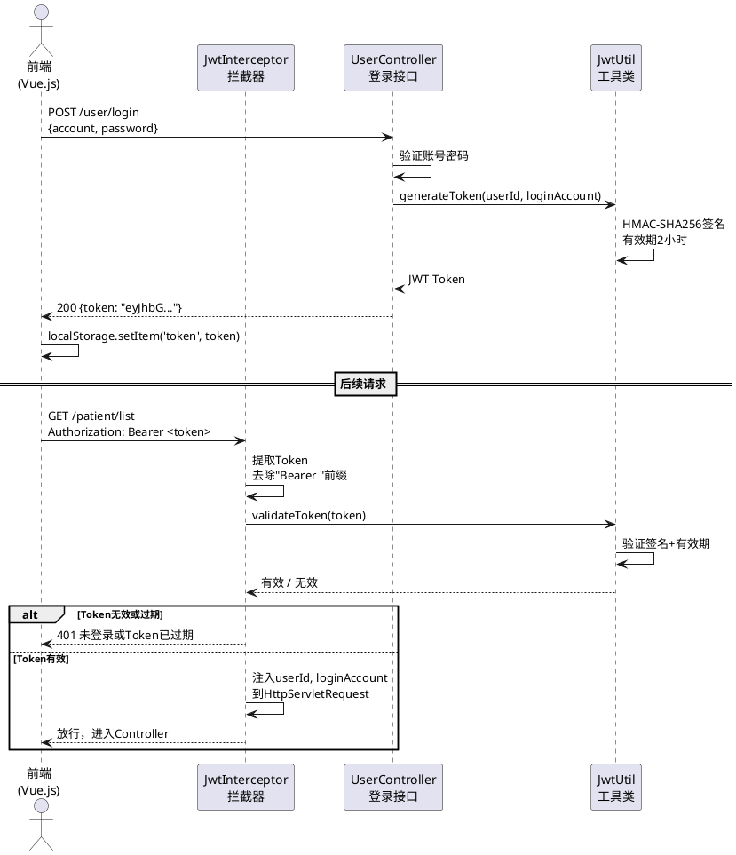

### 图 5-2 RBAC 权限校验流程图

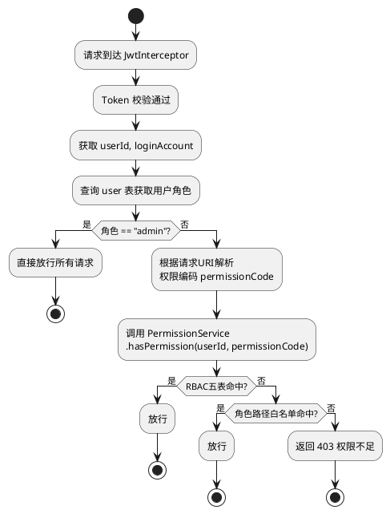

### 图 5-3 AOP 操作日志拦截流程图

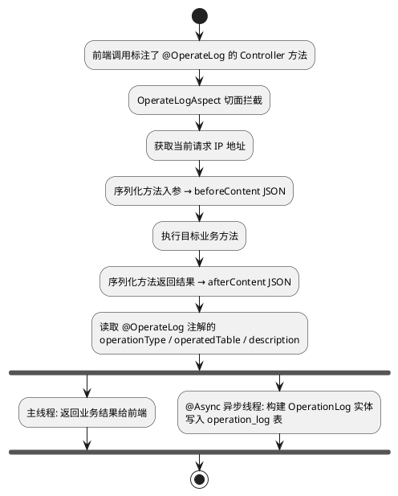

### 图 5-4 EasyExcel 批量导入流程图

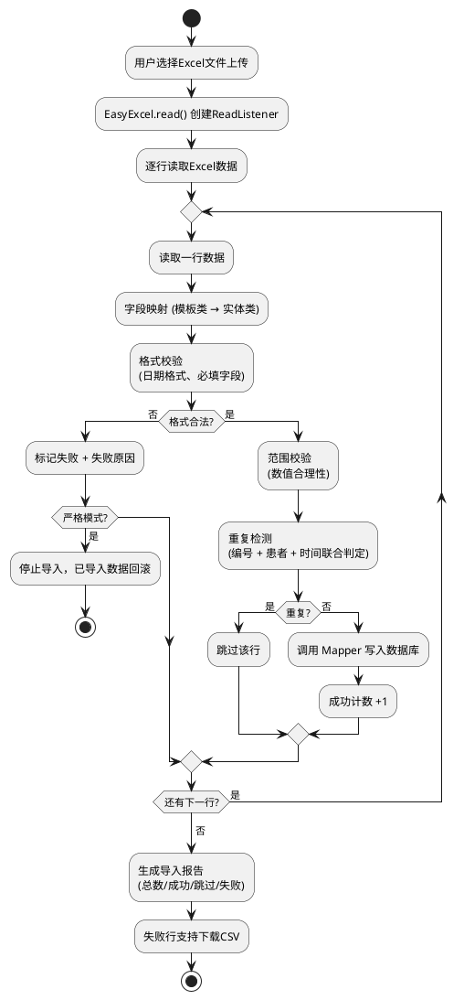

### 图 5-5 Z-Score + 孤立森林联合检测流程图

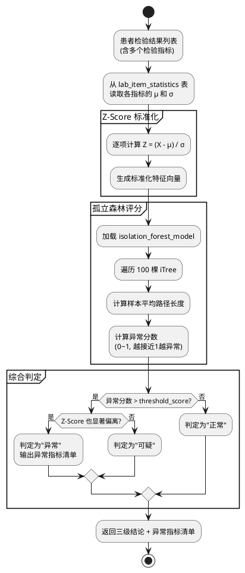

### 图 5-6 WebSocket 预警推送时序图

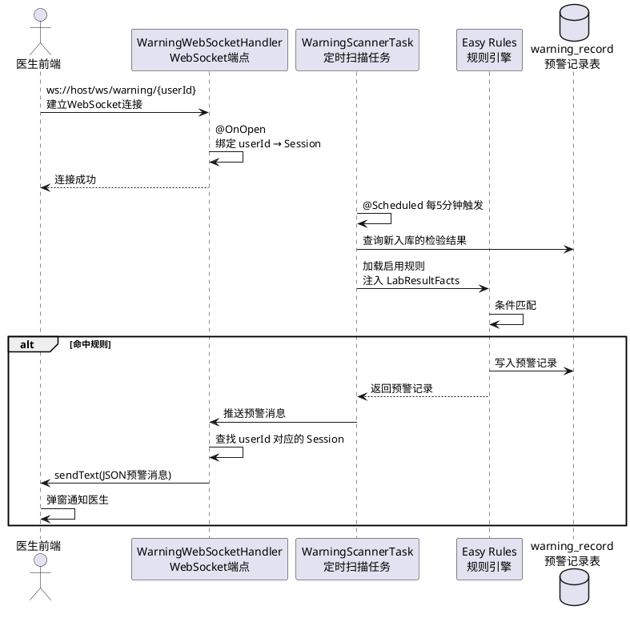

### 图 5-7 系统分层架构调用时序图（患者档案登记）

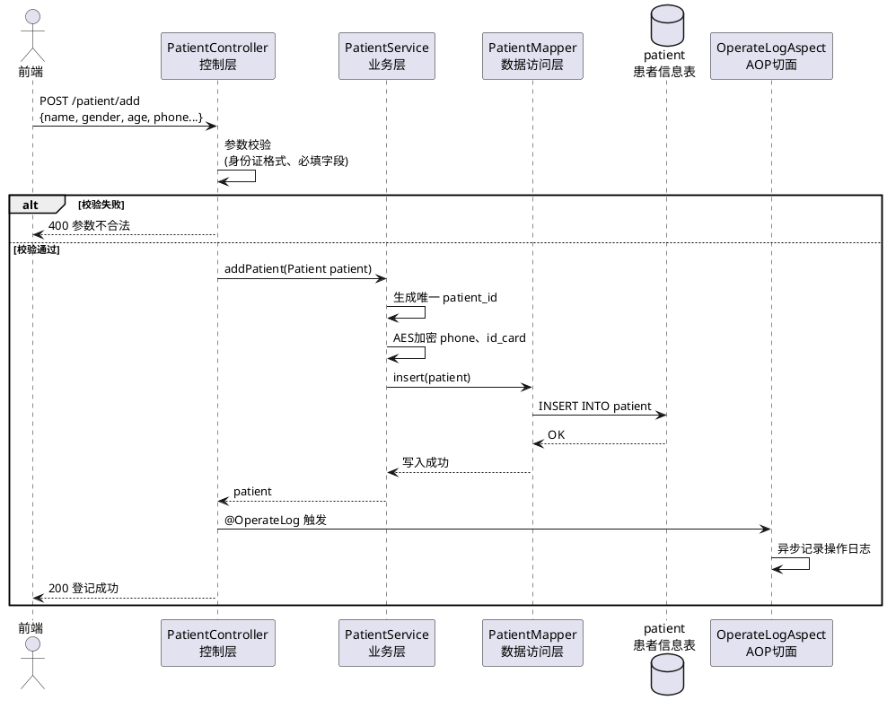

### 图 5-8 就诊全景查询时序图

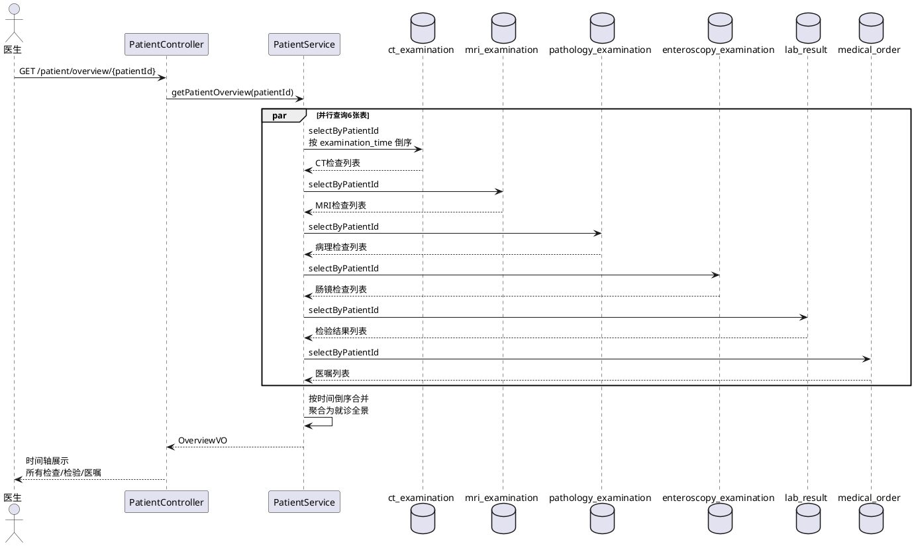

### 图 5-9 检验结果批量登记事务时序图

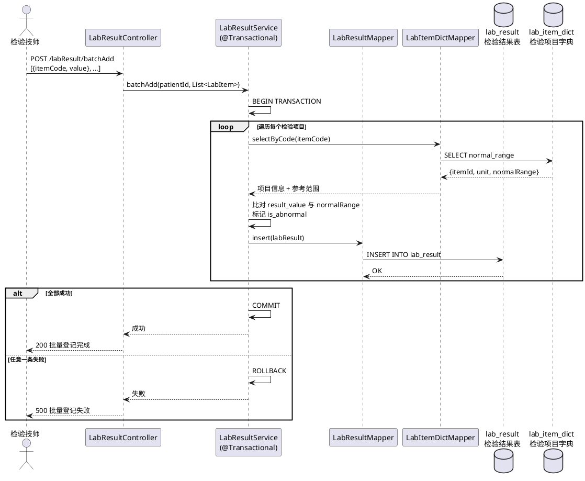

### 图 5-10 查询模板保存与应用活动图

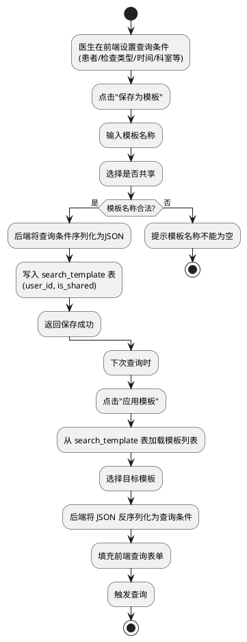

### 图 5-11 预警规则扫描执行活动图

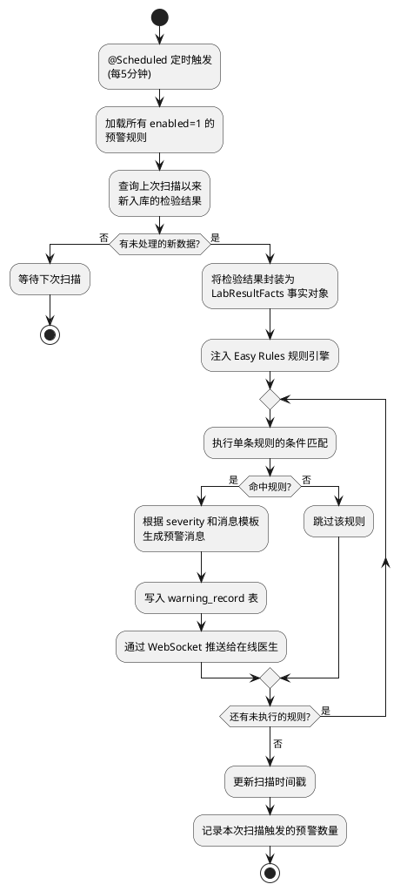

### 图 5-12 多维度统计聚合查询活动图

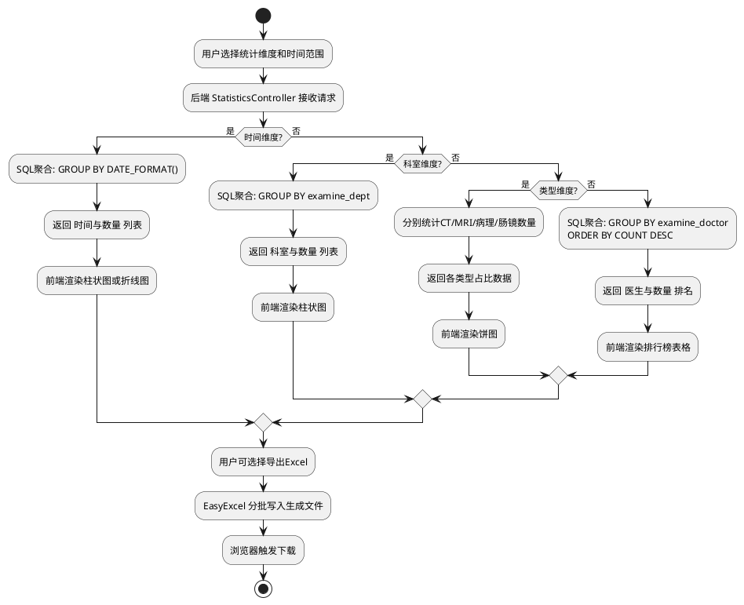

### 图 5-13 数据备份与恢复活动图

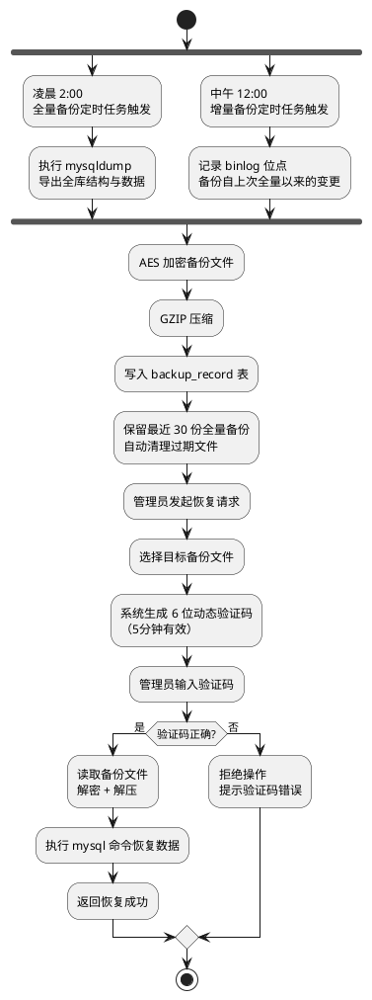

### 图 5-14 外部 API 调用认证链路时序图

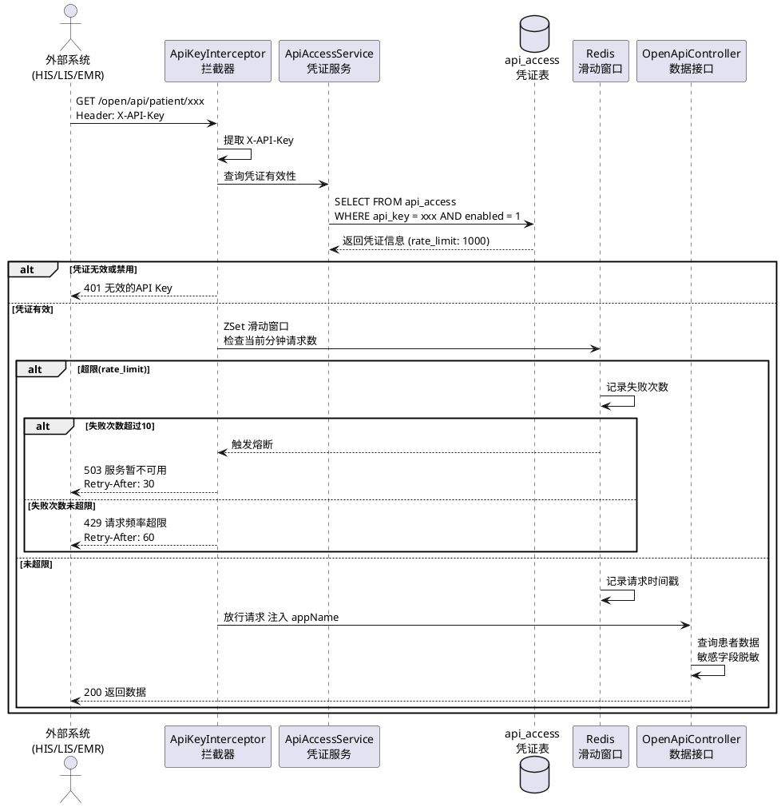
