# 5.1 日常诊疗模块

日常诊疗模块是整个系统的数据基础层，后续智能查询、统计分析、预警监控等所有业务均依赖本模块产生的检查与检验数据。实现上采用 Spring MVC 标准三层架构：Controller 层负责接收 HTTP 请求、校验参数并封装响应，Service 层承载全部业务规则与事务控制，Mapper 层借助 MyBatis-Plus 的 BaseMapper 完成持久化操作。

本模块共涉及七个 Controller 类、七个 Service 接口及实现类、七个 Mapper 接口、十二个实体类以及一个 AOP 切面类。其中四类检查（CT、核磁、病理、肠镜）在代码层面结构完全对称——每种检查类型独立配一组 Controller-Service-Mapper-Entity 四件套，Service 实现类统一继承 MyBatis-Plus 的 ServiceImpl，无需手写基础增删改查代码。下面按患者信息管理、检查记录管理、XML 解析导入、检验结果管理和医嘱管理五个子功能依次展开。

## 5.1.1 患者信息管理

患者信息管理是系统所有数据的入口，负责患者档案的创建、修改、检索与全景汇总查询。本节设计了 PatientController、PatientServiceImpl、PatientMapper 以及 Patient 实体四个核心组件，同时引入 PatientOverviewVO 作为跨表聚合查询的数据传输对象。

### 流程图

患者信息新增从接收表单到完成归档共经历五个处理节点：参数校验、生成编号、敏感字段加密、数据库写入和操作日志记录。其中参数校验由 Controller 层借助 Hibernate Validator 注解完成，敏感信息加密调用 AESUtil工具类在 Service 层执行，操作日志由标注在 Controller 方法上的 @OperateLog 注解触发 AOP 切面异步写入。

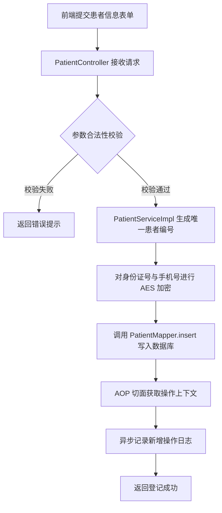

### 时序图

患者新增过程中，Controller 调用 Service、Service 调用 Mapper 的三层调用链路，以及 AOP 切面在目标方法执行后的拦截与日志异步写入，完整时序如图 5-2 所示。

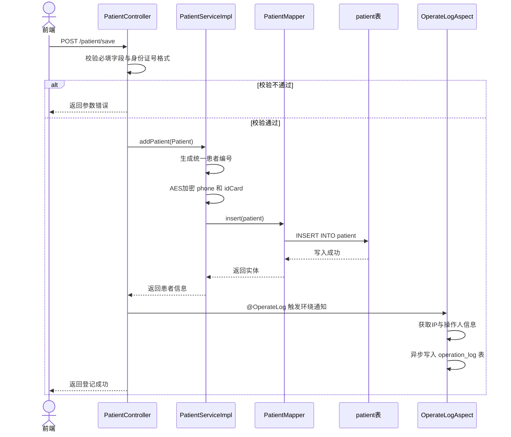

患者全景查询的时序如图所示：PatientController 的 aggregatePatientOverview 方法并行调用六类数据的 Mapper，将同一患者分散在检查、检验、医嘱各表中的历史记录一次性聚合后返回。

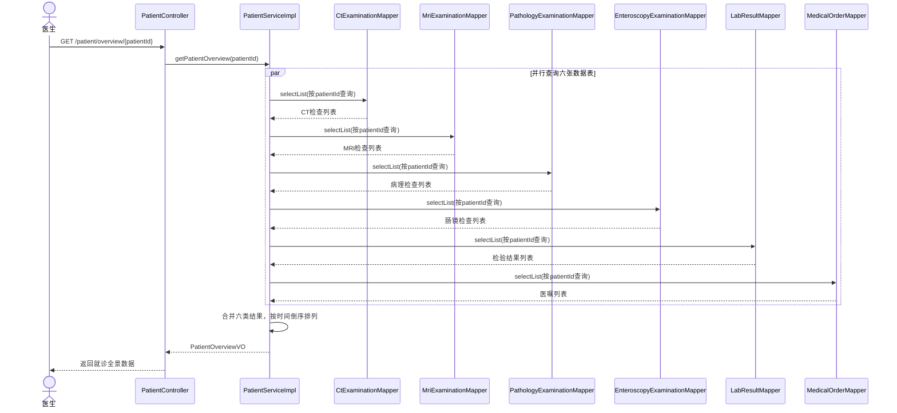

## 5.1.2 检查记录管理

检查记录管理覆盖 CT、核磁、病理、肠镜四类检查的全流程操作。四类检查各对应一组独立的 Controller-Service-Mapper-Entity 组件：CtExaminationController / ICtExaminationService / CtExaminationServiceImpl / CtExaminationMapper / CtExamination，其余三类类推。所有 Service 实现类均继承 MyBatis-Plus 的 ServiceImpl，内置通用 CRUD 方法，无需手写基础增删改查代码。

### 流程图

以 CT 检查为例，从录入到发布报告的完整路径如图所示。其中作废与恢复操作的判断分支体现了逻辑删除的核心设计：作废不是物理删除，而是将 isInvalid 字段翻转；所有查询默认过滤 isInvalid=1 的记录，恢复操作则将标识重置。

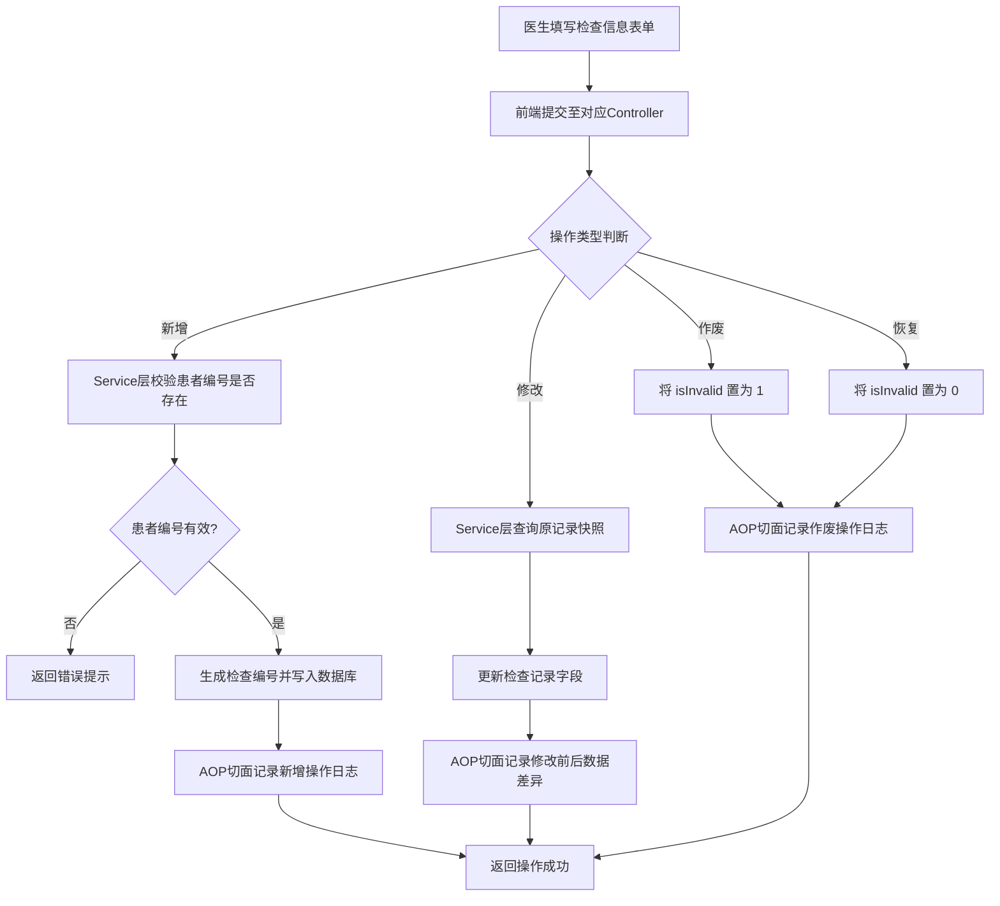

### 时序图

附件上传流程中，Controller 接收 MultipartFile 对象，Service 层生成带时间戳的唯一文件名以避免覆盖，将物理文件写入服务器本地目录后，再将文件访问路径回写到对应检查记录的 reportUrl 字段。

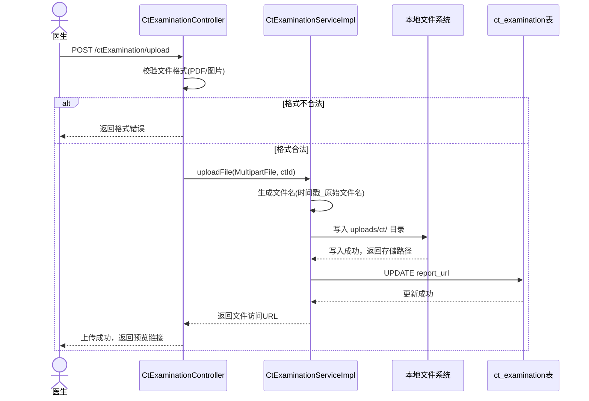

## 5.1.3 XML 解析导入

XML 解析导入是检查记录创建的另一种途径：除手工表单填报外，系统支持接收 HIS、LIS 等外部系统导出的 XML 格式检查报告文件，通过自研 DOM 解析器自动提取字段并写入对应检查记录表。该功能并非批量历史数据迁移，而是一种单条记录录入方式，与批量 Excel 导入在业务定位上有本质区别。

XML 导入涉及的核心类包括：XmlImportHandler（导入入口控制器，负责接收文件并调度解析）、AbstractXmlParser（五种解析器的抽象基类，封装日期兼容解析和 XPath 路径查询的共用逻辑）、CtXmlParser / MriXmlParser / EnteroscopyXmlParser / PathologyXmlParser / LabXmlParser（五种具体解析器实现类）、XmlPathMapping（XML 节点路径到实体字段的映射接口）以及 XmlImportResult（导入结果封装对象，包含成功条数、失败条数及详细错误信息列表）。

### 流程图

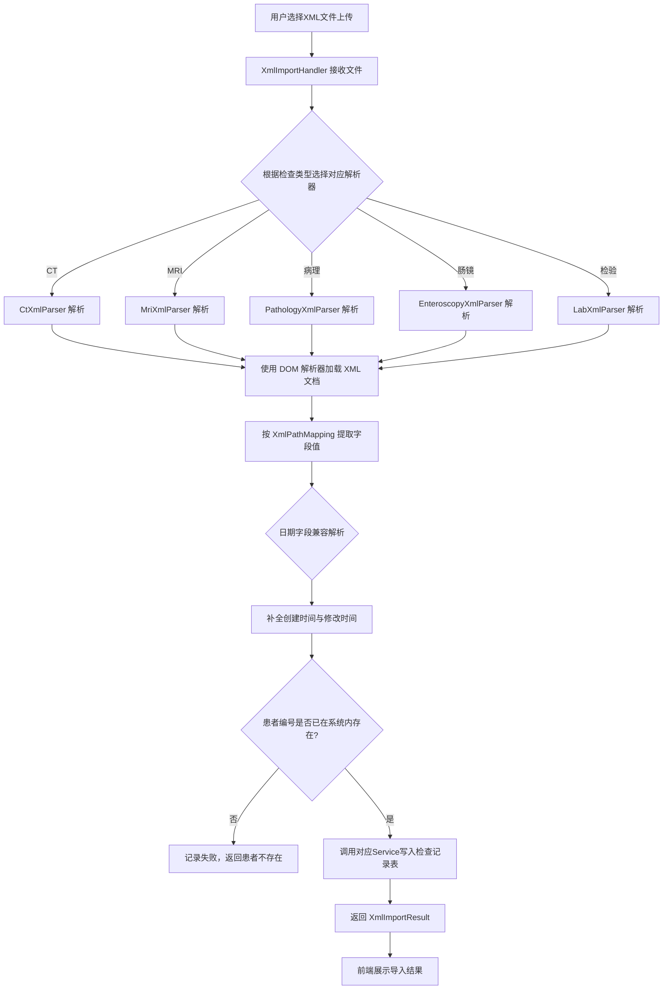

### 时序图

LabXmlParser 相比其他四种解析器多了一个 resolveItemId 私有方法：当 XML 中携带的检验项目代码或名称在系统字典表中无法精确匹配时，该方法先按项目代码匹配，匹配不到再按项目名称进行二次匹配，两次均失败则抛出异常并指明具体的记录序号与字段名称。

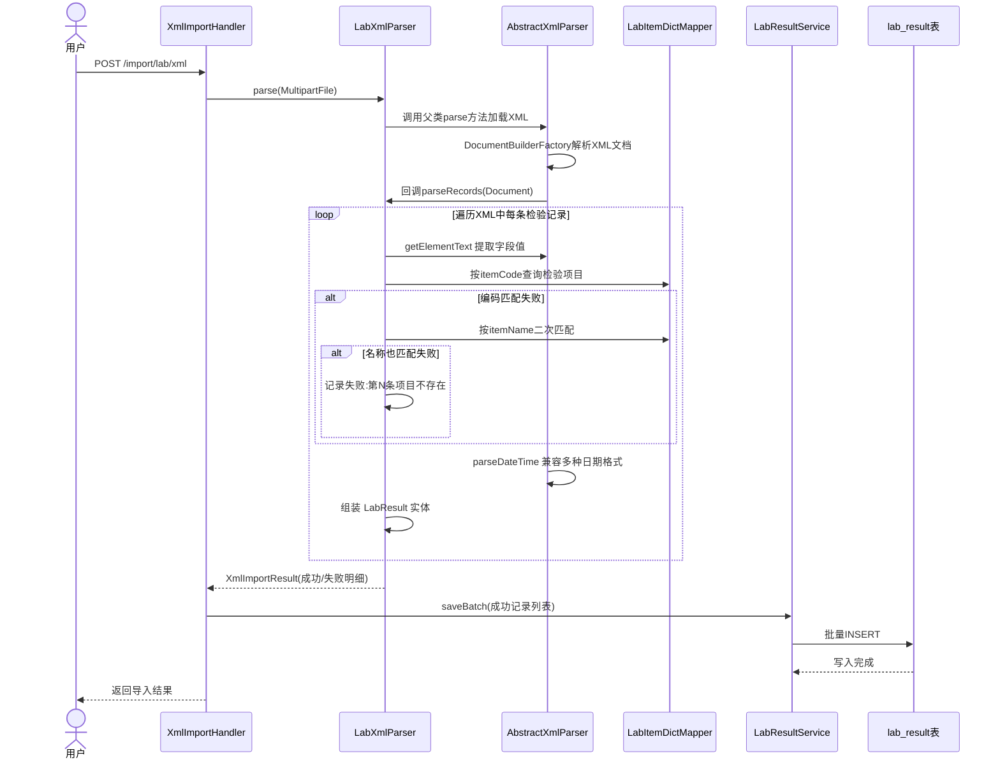

## 5.1.4 检验结果管理

检验结果管理实现检验指标的逐项录入与多项目批量登记。单条录入时系统自动比对检验项目字典中的参考范围，超出范围的数值前端高亮标记；批量登记时一次提交多条检验结果，后端使用 @Transactional 事务控制保证原子性——全部成功则提交，任意一条失败则回滚。设计上，LabResultController 对外暴露两个核心写入接口：/labResult/save（单条录入）和 /labResult/batchSave（批量登记），LabResultServiceImpl 在继承 ServiceImpl 的基础上额外注入了 LabItemDictMapper（用于参照范围比对）和 WarningEngineService（用于异步触发预警评估）。

### 流程图

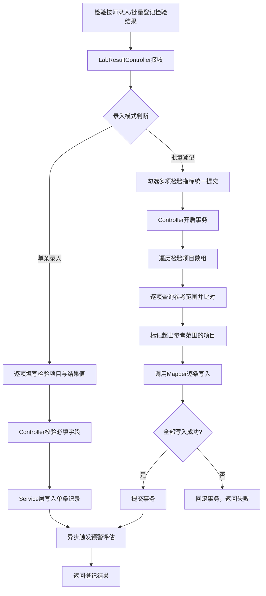

### 时序图

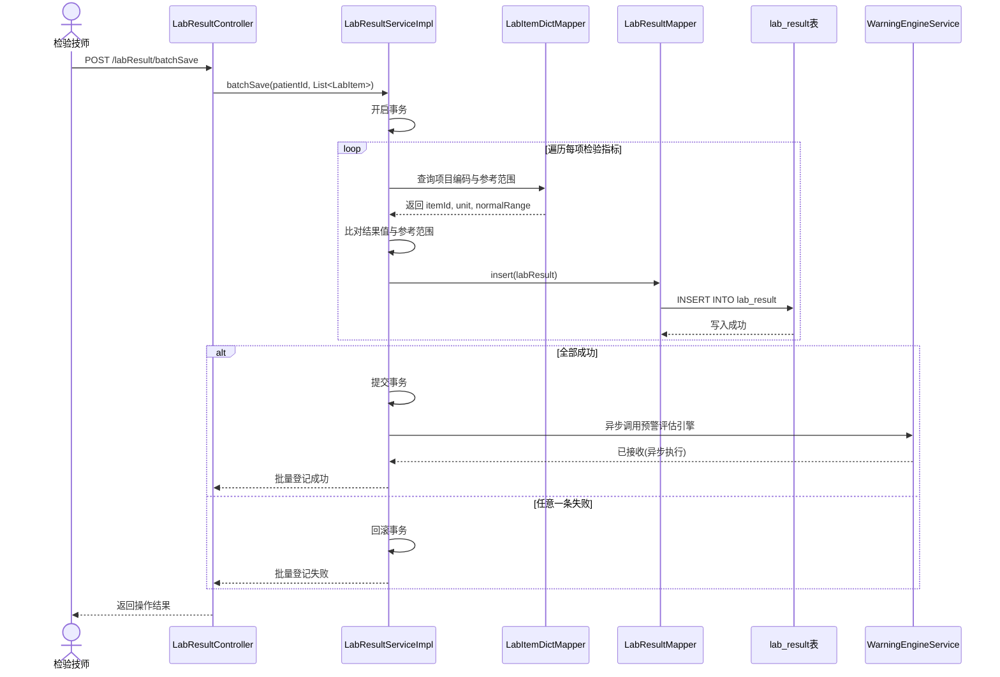

## 5.1.5 医嘱管理

医嘱管理模块在实现上相对独立，涉及 MedicalOrderController、MedicalOrderServiceImpl、MedicalOrderMapper 和 MedicalOrder 实体四个核心组件。Controller 对外暴露 /medicalOrder/save（新增）、/medicalOrder/update（修改）和 /medicalOrder/page（分页查询）三个接口。修改医嘱时系统不覆盖原始记录而是新增一行并将 hospitalizationTimes 递增作为版本标记，查询时取最新版本展示，保留了完整的医嘱变更历史。

### 流程图

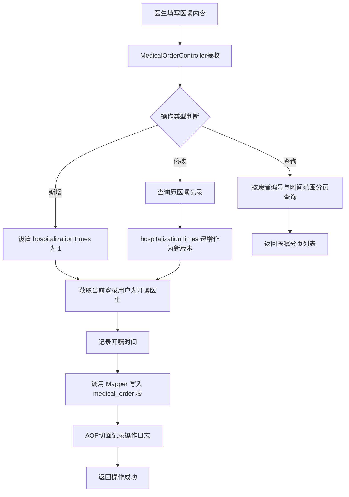

### 时序图

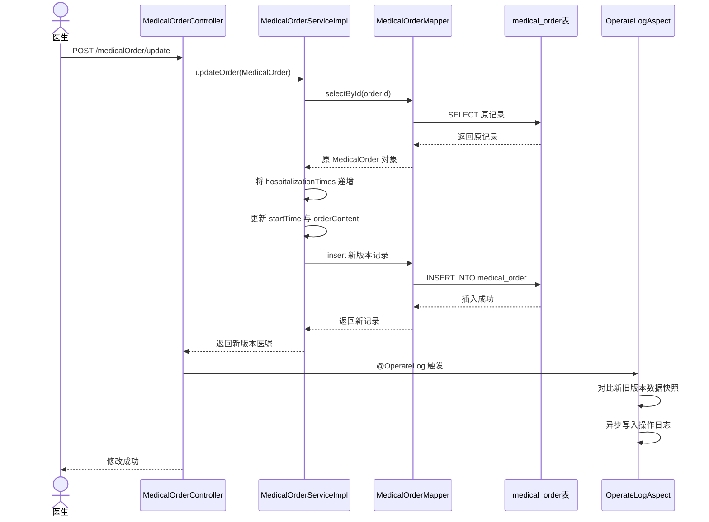

## 日常诊疗模块总类图

下面这张类图汇总了日常诊疗模块全部核心类及其依赖关系。十四行摘要说明如下：

- 患者管理线：PatientController → IPatientService/PatientServiceImpl → PatientMapper，PatientServiceImpl 额外持有四类检查 Mapper 和两个关联 Mapper 的引用，专为全景视图跨表聚合服务
- CT 检查线：CtExaminationController → ICtExaminationService/CtExaminationServiceImpl → CtExaminationMapper → CtExamination 实体
- 核磁检查线：MriExaminationController → IMriExaminationService/MriExaminationServiceImpl → MriExaminationMapper → MriExamination 实体
- 病理检查线：PathologyExaminationController → IPathologyExaminationService/PathologyExaminationServiceImpl → PathologyExaminationMapper → PathologyExamination 实体
- 肠镜检查线：EnteroscopyExaminationController → IEnteroscopyExaminationService/EnteroscopyExaminationServiceImpl → EnteroscopyExaminationMapper → EnteroscopyExamination 实体
- 检验管理线：LabResultController → ILabResultService/LabResultServiceImpl（额外注入 LabItemDictMapper 和 WarningEngineService） → LabResultMapper → LabResult 实体
- 医嘱管理线：MedicalOrderController → IMedicalOrderService/MedicalOrderServiceImpl → MedicalOrderMapper → MedicalOrder 实体
- 附件管理线：Attachment 实体被各检查 Controller 在报告上传时引用，AttachmentMapper 提供独立的附件元信息持久化
- XML 导入线：ImportController 聚合 XmlImportHandler，后者内部根据文件类型动态选择 CtXmlParser/MriXmlParser/EnteroscopyXmlParser/PathologyXmlParser/LabXmlParser 中的一种，每种解析器继承自 AbstractXmlParser
- AOP 横切线：OperateLogAspect 作为切面类以虚线关联所有标注了 @OperateLog 的 Controller 方法，在方法执行前后自动抓取数据快照并通过 IOperationLogService 异步写入操作日志表
- 实体层：所有实体类（Patient / CtExamination / MriExamination / PathologyExamination / EnteroscopyExamination / LabResult / MedicalOrder / Attachment / LabItemDict）均用 MyBatis-Plus 的 @TableName 注解映射对应数据库表
- Mapper 层：所有 Mapper 接口统一继承 BaseMapper，具备内置 CRUD 能力，仅复杂联合查询或统计聚合通过自定义 XML 映射文件实现
- Service 层：四类检查的 ServiceImpl 直接继承 ServiceImpl，无需任何额外代码；PatientServiceImpl 和 LabResultServiceImpl 因业务复杂度较高，在继承基础上额外注入关联依赖
- 类图图例：实线箭头「→」表示依赖注入（@Autowired），空心三角箭头「▷」表示接口实现，闭合三角箭头「▷」表示继承，虚线箭头「- - >」表示 AOP 切面拦截

```mermaid
classDiagram
    class PatientController {
        +save(Patient) Result
        +update(Patient) Result
        +delete(String) Result
        +restore(String) Result
        +overview(String) Result
    }
    class IPatientService {
        <<interface>>
        +addPatient(Patient) Patient
        +updatePatient(Patient) boolean
        +getPatientOverview(String) PatientOverviewVO
    }
    class PatientServiceImpl {
        -PatientMapper patientMapper
        -CtExaminationMapper ctMapper
        -MriExaminationMapper mriMapper
        -PathologyExaminationMapper pathMapper
        -EnteroscopyExaminationMapper enteroMapper
        -LabResultMapper labMapper
        -MedicalOrderMapper orderMapper
        +addPatient(Patient) Patient
        +getPatientOverview(String) PatientOverviewVO
    }
    class PatientMapper {
        +insert(Patient) int
        +selectById(String) Patient
        +selectList(Wrapper) List
    }
    class Patient {
        -String patientId
        -String patientName
        -String gender
        -Integer age
        -String phone
        -String idCard
        -Boolean isInvalid
    }
    class PatientOverviewVO {
        -List~CtExamination~ ctList
        -List~MriExamination~ mriList
        -List~PathologyExamination~ pathList
        -List~EnteroscopyExamination~ enteroList
        -List~LabResult~ labList
        -List~MedicalOrder~ orderList
    }

    class CtExaminationController {
        +save(CtExamination) Result
        +update(CtExamination) Result
        +delete(Long) Result
        +upload(MultipartFile,Long) Result
        +download(Long,HttpServletResponse) void
    }
    class ICtExaminationService {
        <<interface>>
    }
    class CtExaminationServiceImpl {
    }
    class CtExaminationMapper {
        +selectList(Wrapper) List
    }
    class CtExamination {
        -Long ctId
        -String patientId
        -String examinationNo
        -LocalDateTime examinationTime
        -String examinationPart
        -String examineDoctor
        -String examineDept
        -String reportUrl
        -String imageUrl
        -String reportConclusion
        -Integer userId
        -Boolean isInvalid
    }

    class MriExaminationController {
        +save(MriExamination) Result
        +update(MriExamination) Result
        +upload(MultipartFile,Long) Result
    }
    class IMriExaminationService {
        <<interface>>
    }
    class MriExaminationServiceImpl {
    }
    class MriExaminationMapper {
    }
    class MriExamination {
        -Long mriId
        -String patientId
        -String examinationNo
        -LocalDateTime examinationTime
        -String examinationPart
        -String examineDoctor
        -String examineDept
        -String reportUrl
        -String imageUrl
        -String reportConclusion
        -Integer userId
        -Boolean isInvalid
    }

    class PathologyExaminationController {
        +save(PathologyExamination) Result
        +upload(MultipartFile,Long) Result
    }
    class IPathologyExaminationService {
        <<interface>>
    }
    class PathologyExaminationServiceImpl {
    }
    class PathologyExaminationMapper {
    }
    class PathologyExamination {
        -Long pathologyId
        -String patientId
        -String pathologyNo
        -String specimenType
        -LocalDateTime samplingTime
        -LocalDateTime reportTime
        -String pathologyDoctor
        -String pathologyDept
        -String reportUrl
        -String slideImageUrl
        -String pathologyDiagnosis
        -Integer userId
        -Boolean isInvalid
    }

    class EnteroscopyExaminationController {
        +save(EnteroscopyExamination) Result
        +upload(MultipartFile,Long) Result
    }
    class IEnteroscopyExaminationService {
        <<interface>>
    }
    class EnteroscopyExaminationServiceImpl {
    }
    class EnteroscopyExaminationMapper {
    }
    class EnteroscopyExamination {
        -Long enteroscopyId
        -String patientId
        -String examinationNo
        -LocalDateTime examinationTime
        -String enteroscopyType
        -String examineDoctor
        -String examineDept
        -String reportUrl
        -String imageUrl
        -String reportConclusion
        -Integer userId
        -Boolean isInvalid
    }

    class LabResultController {
        +save(LabResult) Result
        +batchSave(List~LabResult~) Result
        +getTrend(String,int) Result
    }
    class ILabResultService {
        <<interface>>
        +batchSave(String,List) boolean
        +getTrendData(String,int) List~TrendVO~
    }
    class LabResultServiceImpl {
        -LabResultMapper labMapper
        -LabItemDictMapper dictMapper
        -WarningEngineService warningEngine
        +batchSave(String,List) boolean
        +getTrendData(String,int) List~TrendVO~
    }
    class LabResultMapper {
    }
    class LabResult {
        -Long resultId
        -String patientId
        -Integer itemId
        -BigDecimal resultValue
        -String resultUnit
        -LocalDateTime reportTime
        -String executeDept
        -String executeDoc
        -Boolean isInvalid
    }
    class LabItemDictMapper {
        +selectByCode(String) LabItemDict
        +selectList(Wrapper) List
    }
    class LabItemDict {
        -Integer itemId
        -String itemName
        -String itemCode
        -String defaultUnit
        -String normalRange
    }

    class MedicalOrderController {
        +save(MedicalOrder) Result
        +update(MedicalOrder) Result
        +page(QueryPageParam) Result
    }
    class IMedicalOrderService {
        <<interface>>
    }
    class MedicalOrderServiceImpl {
    }
    class MedicalOrderMapper {
    }
    class MedicalOrder {
        -Long orderId
        -Integer hospitalizationTimes
        -String patientId
        -String orderName
        -LocalDateTime startTime
        -LocalDateTime endTime
        -String orderStatus
        -String orderFrequency
        -String executeDept
        -String executeDoc
        -Boolean isInvalid
    }

    class Attachment {
        -Long attachmentId
        -String patientId
        -String attachmentName
        -String attachmentType
        -String storageUrl
        -Integer userId
        -Long relatedResultId
        -Boolean isInvalid
    }
    class AttachmentMapper {
    }

    class ImportController {
        +importCtXml(MultipartFile) Result
        +importLabXml(MultipartFile) Result
    }
    class XmlImportHandler {
        -LabItemDictMapper dictMapper
        -IPatientService patientService
        -ICtExaminationService ctService
        -IMriExaminationService mriService
        -IPathologyExaminationService pathService
        -IEnteroscopyExaminationService enteroService
        -ILabResultService labService
        +importXml(MultipartFile,String) XmlImportResult
    }
    class AbstractXmlParser {
        <<abstract>>
        +parse(MultipartFile) XmlImportResult
        #parseDateTime(String) LocalDateTime
        #getElementText(Element,String) String
        #parseRecords(Document) List
    }
    class CtXmlParser {
        +parseRecords(Document) List~CtExamination~
    }
    class MriXmlParser {
        +parseRecords(Document) List~MriExamination~
    }
    class EnteroscopyXmlParser {
        +parseRecords(Document) List~EnteroscopyExamination~
    }
    class PathologyXmlParser {
        +parseRecords(Document) List~PathologyExamination~
    }
    class LabXmlParser {
        -LabItemDictMapper dictMapper
        +parseRecords(Document) List~LabResult~
        -resolveItemId(String,String) Integer
    }
    class XmlPathMapping {
        <<interface>>
    }

    class OperateLogAspect {
        -IOperationLogService logService
        +around(ProceedingJoinPoint) Object
        -saveLogAsync(OperationLogContext) void
    }
    class OperateLog {
        -Long logId
        -Integer userId
        -String operationType
        -String operatedTable
        -String beforeContent
        -String afterContent
    }

    PatientController --> IPatientService
    IPatientService <|.. PatientServiceImpl
    PatientServiceImpl --> PatientMapper
    PatientServiceImpl --> CtExaminationMapper
    PatientServiceImpl --> MriExaminationMapper
    PatientServiceImpl --> PathologyExaminationMapper
    PatientServiceImpl --> EnteroscopyExaminationMapper
    PatientServiceImpl --> LabResultMapper
    PatientServiceImpl --> MedicalOrderMapper
    PatientMapper ..> Patient
    PatientServiceImpl ..> PatientOverviewVO

    CtExaminationController --> ICtExaminationService
    ICtExaminationService <|.. CtExaminationServiceImpl
    CtExaminationServiceImpl --> CtExaminationMapper
    CtExaminationMapper ..> CtExamination

    MriExaminationController --> IMriExaminationService
    IMriExaminationService <|.. MriExaminationServiceImpl
    MriExaminationServiceImpl --> MriExaminationMapper
    MriExaminationMapper ..> MriExamination

    PathologyExaminationController --> IPathologyExaminationService
    IPathologyExaminationService <|.. PathologyExaminationServiceImpl
    PathologyExaminationServiceImpl --> PathologyExaminationMapper
    PathologyExaminationMapper ..> PathologyExamination

    EnteroscopyExaminationController --> IEnteroscopyExaminationService
    IEnteroscopyExaminationService <|.. EnteroscopyExaminationServiceImpl
    EnteroscopyExaminationServiceImpl --> EnteroscopyExaminationMapper
    EnteroscopyExaminationMapper ..> EnteroscopyExamination

    LabResultController --> ILabResultService
    ILabResultService <|.. LabResultServiceImpl
    LabResultServiceImpl --> LabResultMapper
    LabResultServiceImpl --> LabItemDictMapper
    LabResultServiceImpl --> WarningEngineService
    LabResultMapper ..> LabResult
    LabItemDictMapper ..> LabItemDict

    MedicalOrderController --> IMedicalOrderService
    IMedicalOrderService <|.. MedicalOrderServiceImpl
    MedicalOrderServiceImpl --> MedicalOrderMapper
    MedicalOrderMapper ..> MedicalOrder

    ImportController --> XmlImportHandler
    XmlImportHandler --> IPatientService
    XmlImportHandler --> ICtExaminationService
    XmlImportHandler --> ILabResultService
    AbstractXmlParser <|-- CtXmlParser
    AbstractXmlParser <|-- MriXmlParser
    AbstractXmlParser <|-- EnteroscopyXmlParser
    AbstractXmlParser <|-- PathologyXmlParser
    AbstractXmlParser <|-- LabXmlParser
    AbstractXmlParser ..> XmlPathMapping
    LabXmlParser --> LabItemDictMapper
    XmlImportHandler --> AbstractXmlParser

    OperateLogAspect --> IOperationLogService
    OperateLogAspect ..> PatientController
    OperateLogAspect ..> CtExaminationController
    OperateLogAspect ..> MedicalOrderController
    OperateLogAspect ..> LabResultController
    IOperationLogService ..> OperateLog
```
