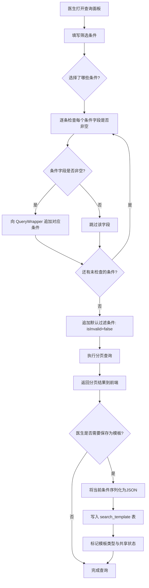
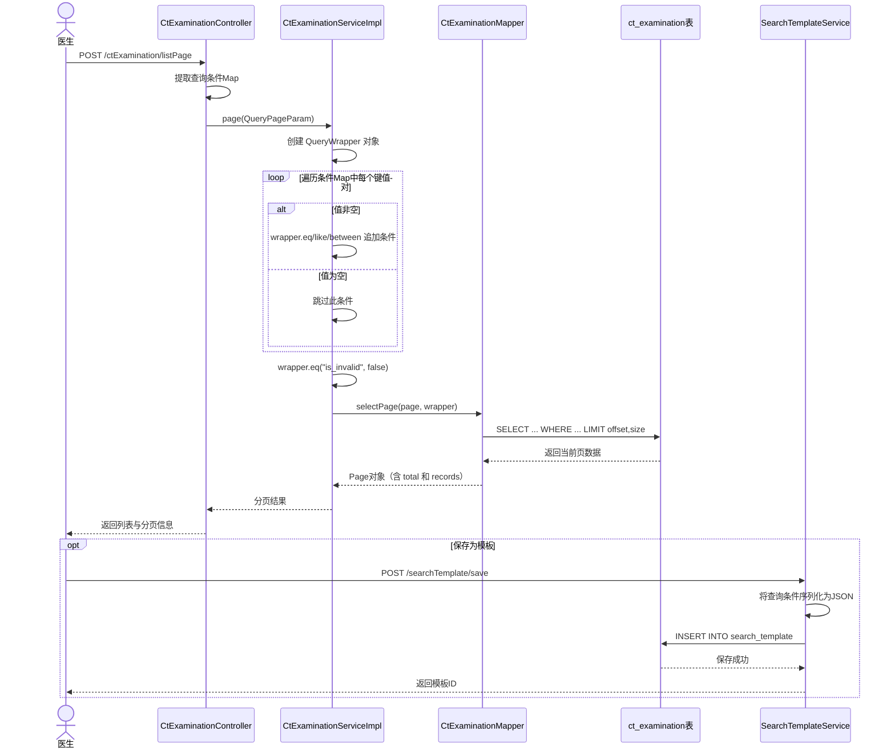
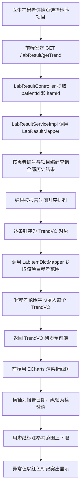
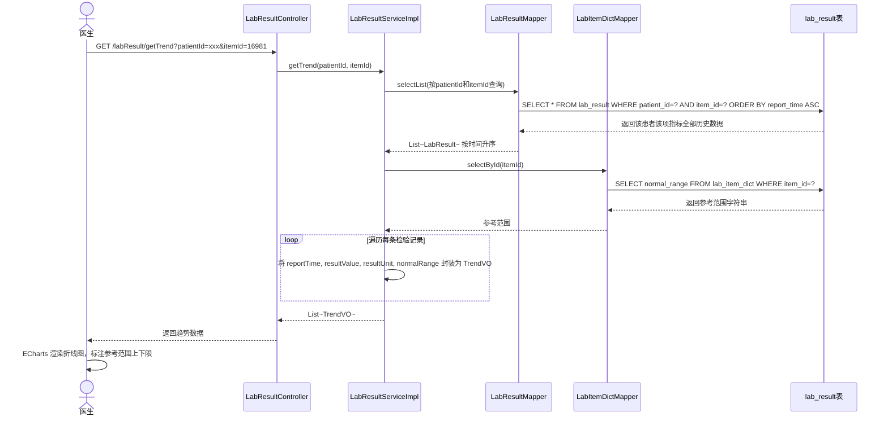
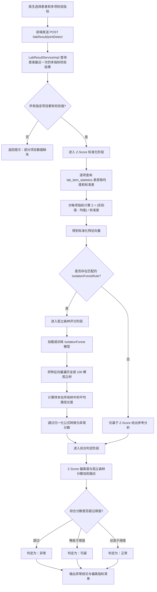
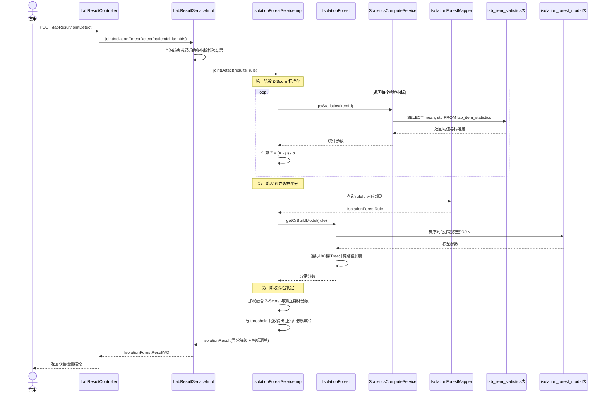

# 5.2 智能查询与辅助诊断模块

智能查询与辅助诊断模块解决日常诊疗模块沉淀的海量检查数据"查得到"和"看得懂"两个核心问题。三个子功能分别从不同层面提升数据的可用价值：多条件组合查询让用户以任意维度灵活筛选目标记录，指标趋势分析将分散的检验值转化为直观的时序曲线，多指标联合异常检测则从单指标超限判断升级为多维度综合评分，挖掘人工审核难以发现的关联异常模式。下面按这三个子功能依次展开。

## 5.2.1 多条件组合查询

多条件组合查询的核心不在于算法复杂，而在于 SQL 构建策略的灵活性。系统为四类检查（CT、核磁、病理、肠镜）和检验结果分别提供独立的查询面板，每类面板支持患者编号、姓名、检查编号、检查部位、检查医生、所属科室、检查时间范围等多个维度自由组合。本节以 CT 检查为例说明设计实现。

涉及的核心类包括：CtExaminationController（查询入口，暴露 /ctExamination/listPage 分页接口）、ICtExaminationService / CtExaminationServiceImpl（查询逻辑封装）、CtExaminationMapper（底层 MyBatis-Plus BaseMapper）以及 SearchTemplateController / SearchTemplateServiceImpl / SearchTemplateMapper / SearchTemplate（查询模板的保存、加载与共享功能）。

### 流程图

查询流程分为条件构造和模板管理两路。条件构造一路用 QueryWrapper 动态拼接仅含非空条件的 WHERE 子句，模板管理一路将当前筛选条件序列化为 JSON 存入 search_template 表以便复用。

### 时序图

## 5.2.2 检验指标趋势分析

趋势分析将某位患者某项检验指标的全部历史结果以折线图形式呈现，帮助医生快速判断指标的长期变化方向——是持续升高、逐步下降还是趋于稳定。该功能尤其适用于糖尿病血糖监测、肾功能肌酐随访等慢性病管理场景。

涉及的核心类包括：LabResultController（暴露 /labResult/getTrend 接口，接收 patientId 和 itemId 两个参数）、LabResultServiceImpl（实现 getTrendData 方法，查询历史数据并按时间排序）、LabResultMapper（执行按患者和项目的联合查询）、LabItemDictMapper（获取当前项目的最新参考范围字符串）以及 TrendVO（数据传输对象，封装时间、结果值、单位和参考范围四个字段）。

### 流程图

### 时序图

## 5.2.3 多指标联合异常检测

多指标联合异常检测是智能查询模块中算法最复杂的子功能。当医生怀疑某位患者可能存在代谢或血液系统问题时，可选择一组检验指标（如肝功能组合或血脂组合）发起联合检测。系统通过 Z-Score 标准化消除各指标量纲差异，再调用预训练的孤立森林模型从多指标组合维度计算异常分数，最终输出"正常 / 可疑 / 异常"三级判定结论及异常贡献最高的指标清单。

涉及的核心组件包括：LabResultController（暴露 /labResult/jointDetect 接口）、LabResultServiceImpl（协调检测流程）、IsolationForestServiceImpl（实现 jointDetect 核心算法，封装 Z-Score 标准化、孤立森林评分与综合判定三类逻辑）、IsolationForestMapper / IsolationForestModelMapper（持久化孤立森林规则与训练模型）、IsolationForest（纯 Java 实现的孤立森林算法类，封装 buildForest 训练方法和 predict 预测方法）、IsolationForestRule / IsolationForestModel（规则与模型的实体类）、LabItemStatistics（各检验项目历史均值和标准差的统计记录）以及 IStatisticsComputeService（负责 Z-Score 标准化所需的均值和标准差数据的计算与缓存）。

### 流程图

### 时序图

## 智能查询与辅助诊断模块总类图

下面这张类图汇总了智能查询与辅助诊断模块全部核心类及其依赖关系。图中上半区为查询分析线（从各类检查 Controller 到 Mapper），下半区为孤立森林算法线（从 LabResultController 逐层穿透到 IsolationForest 核心算法类），左侧为查询模板辅助线，底部分别为统计计算（Z-Score 数据来源）和 Redis 缓存加速（热点数据缓存）两条支撑线。

```mermaid
classDiagram
    class CtExaminationController {
        +listPage(QueryPageParam) Result
        +export(QueryPageParam,HttpServletResponse) void
    }
    class CtExaminationServiceImpl {
        +page(QueryPageParam) Page
    }
    class CtExaminationMapper {
    }

    class MriExaminationController {
        +listPage(QueryPageParam) Result
    }
    class MriExaminationServiceImpl {
    }
    class MriExaminationMapper {
    }

    class PathologyExaminationController {
        +listPage(QueryPageParam) Result
    }
    class PathologyExaminationServiceImpl {
    }
    class PathologyExaminationMapper {
    }

    class EnteroscopyExaminationController {
        +listPage(QueryPageParam) Result
    }
    class EnteroscopyExaminationServiceImpl {
    }
    class EnteroscopyExaminationMapper {
    }

    class LabResultController {
        +listPage(QueryPageParam) Result
        +getTrend(String,int) Result
        +jointDetect(JointDetectRequest) Result
    }
    class ILabResultService {
        <<interface>>
        +getTrend(String,int) Result
        +jointIsolationForestDetect(String,List) IsolationForestResultVO
    }
    class LabResultServiceImpl {
        -LabResultMapper labResultMapper
        -LabItemDictMapper dictMapper
        -IsolationForestService ifService
        +getTrend(String,int) Result
        +jointIsolationForestDetect(String,List) IsolationForestResultVO
    }
    class LabResultMapper {
    }
    class LabItemDictMapper {
    }

    class SearchTemplateController {
        +save(SearchTemplate) Result
        +listByUser(Integer) Result
        +delete(Long) Result
    }
    class ISearchTemplateService {
        <<interface>>
    }
    class SearchTemplateServiceImpl {
    }
    class SearchTemplateMapper {
    }
    class SearchTemplate {
        -Long templateId
        -String templateName
        -String templateType
        -String queryConditions
        -Integer userId
        -Boolean isShared
    }

    class IIsolationForestService {
        <<interface>>
        +jointDetect(List,IsolationForestRule) IsolationResult
        +trainModel(Long) void
        +rebuildAllModels() void
        +getAllEnabledRules() List
    }
    class IsolationForestServiceImpl {
        -IsolationForestMapper ruleMapper
        -IsolationForestModelMapper modelMapper
        -LabResultMapper labResultMapper
        -LabItemDictMapper dictMapper
        -StatisticsComputeService statService
        -Map~Long,IsolationForest~ modelCache
        +jointDetect(List,IsolationForestRule) IsolationResult
        +buildModel(IsolationForestRule) void
        -buildFeatureVector(List,List) double[]
        -zscoreDetect(List,List) Map
        -combinedScoreMethod(Map,double) double
        -determineAnomalyLevel(double,Map) String
    }
    class IsolationForest {
        -List~IsolationTree~ trees
        -int numTrees
        -int maxDepth
        -int sampleSize
        +buildForest(List~double[]~,int,int) void
        +predict(double[]) double
    }
    class IsolationTree {
        -TreeNode root
        +build(double[][],int,int) void
    }
    class TreeNode {
        -int featureIndex
        -double splitValue
        -TreeNode left
        -TreeNode right
        -int size
        -boolean isLeaf
    }

    class IsolationForestMapper {
        +selectById(Long) IsolationForestRule
        +selectList(Wrapper) List
    }
    class IsolationForestModelMapper {
        +selectOne(Wrapper) IsolationForestModel
        +insert(IsolationForestModel) int
        +updateById(IsolationForestModel) int
    }
    class IsolationForestRule {
        -Long ruleId
        -String ruleName
        -String itemIds
        -BigDecimal contamination
        -BigDecimal thresholdScore
        -Boolean enabled
        -String severity
        -String description
    }
    class IsolationForestModel {
        -Long modelId
        -Long ruleId
        -String itemIds
        -String modelParams
        -LocalDateTime trainedAt
        -Integer sampleCount
        -BigDecimal meanScore
        -BigDecimal stdScore
    }

    class IStatisticsComputeService {
        <<interface>>
        +getStatistics(int,String) LabItemStatistics
        +updateStatistics(int,String) void
    }
    class StatisticsComputeServiceImpl {
        -LabResultMapper labResultMapper
        -RedisTemplate redisTemplate
        +getStatistics(int,String) LabItemStatistics
    }
    class LabItemStatistics {
        -Long statId
        -Integer itemId
        -String deptCode
        -Integer sampleCount
        -BigDecimal meanValue
        -BigDecimal stdDeviation
        -BigDecimal minValue
        -BigDecimal maxValue
    }

    class TrendVO {
        -LocalDateTime reportTime
        -BigDecimal resultValue
        -String resultUnit
        -String normalRange
    }
    class IsolationForestResultVO {
        -boolean triggered
        -String anomalyLevel
        -double isolationScore
        -double combinedScore
        -double threshold
        -String alertMessage
        -Map~Integer,Double~ zscoreAnomalies
    }
    class JointDetectRequest {
        -String patientId
        -List~Integer~ itemIds
    }

    CtExaminationController --> CtExaminationServiceImpl
    CtExaminationServiceImpl --> CtExaminationMapper
    MriExaminationController --> MriExaminationServiceImpl
    MriExaminationServiceImpl --> MriExaminationMapper
    PathologyExaminationController --> PathologyExaminationServiceImpl
    PathologyExaminationServiceImpl --> PathologyExaminationMapper
    EnteroscopyExaminationController --> EnteroscopyExaminationServiceImpl
    EnteroscopyExaminationServiceImpl --> EnteroscopyExaminationMapper

    LabResultController --> ILabResultService
    ILabResultService <|.. LabResultServiceImpl
    LabResultServiceImpl --> LabResultMapper
    LabResultServiceImpl --> LabItemDictMapper
    LabResultServiceImpl --> IIsolationForestService
    LabResultServiceImpl ..> TrendVO
    LabResultController ..> JointDetectRequest

    SearchTemplateController --> ISearchTemplateService
    ISearchTemplateService <|.. SearchTemplateServiceImpl
    SearchTemplateServiceImpl --> SearchTemplateMapper
    SearchTemplateMapper ..> SearchTemplate

    IIsolationForestService <|.. IsolationForestServiceImpl
    IsolationForestServiceImpl --> IsolationForestMapper
    IsolationForestServiceImpl --> IsolationForestModelMapper
    IsolationForestServiceImpl --> LabResultMapper
    IsolationForestServiceImpl --> LabItemDictMapper
    IsolationForestServiceImpl --> IStatisticsComputeService
    IsolationForestServiceImpl --> IsolationForest
    IsolationForestServiceImpl ..> IsolationForestRule
    IsolationForestServiceImpl ..> IsolationForestModel
    IsolationForestServiceImpl ..> LabItemStatistics
    LabResultServiceImpl ..> IsolationForestResultVO

    IsolationForest *-- IsolationTree
    IsolationTree *-- TreeNode
    IsolationForestMapper ..> IsolationForestRule
    IsolationForestModelMapper ..> IsolationForestModel

    IStatisticsComputeService <|.. StatisticsComputeServiceImpl
    StatisticsComputeServiceImpl --> LabResultMapper
    StatisticsComputeServiceImpl ..> LabItemStatistics
```

